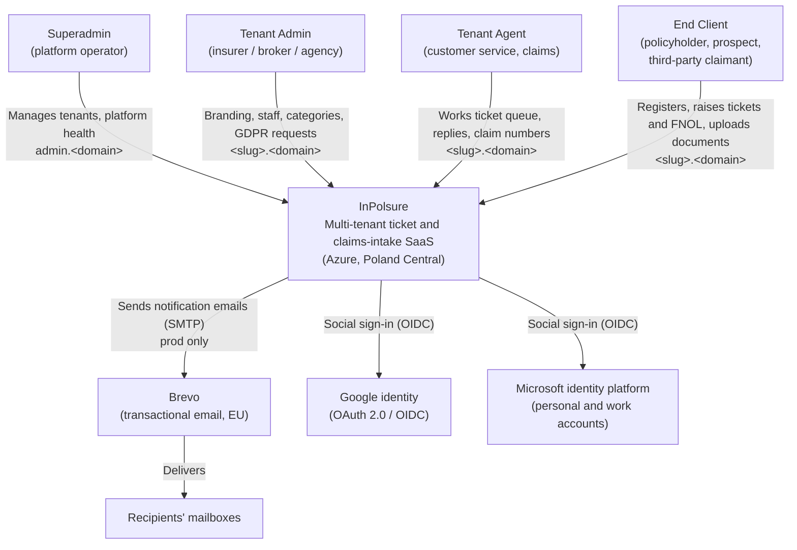
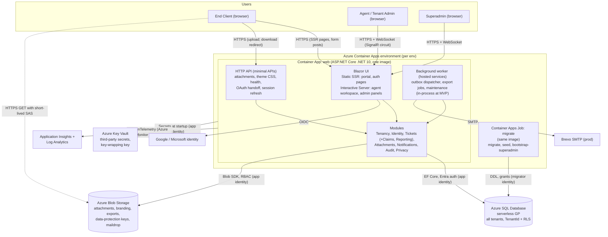
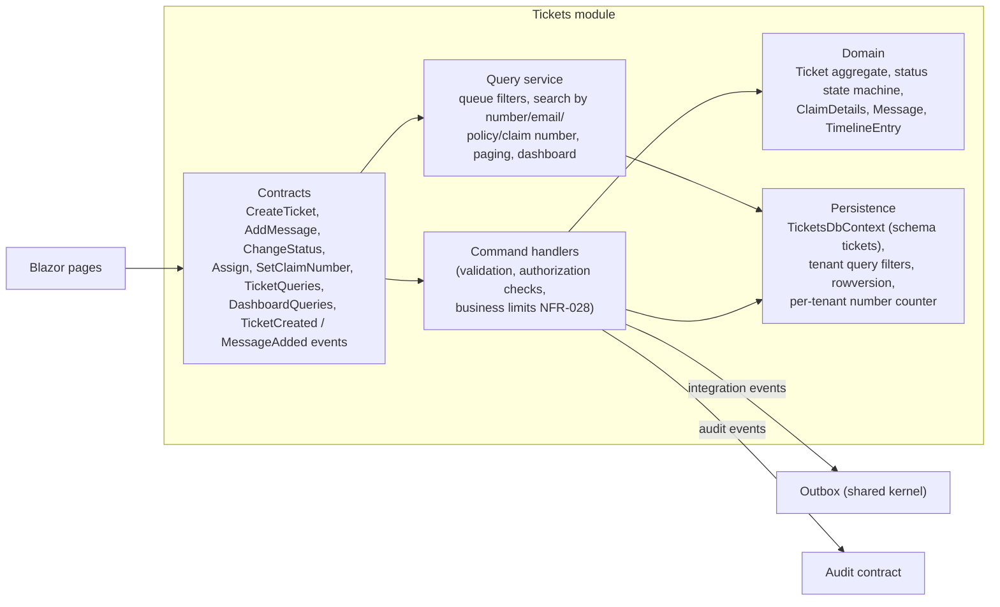
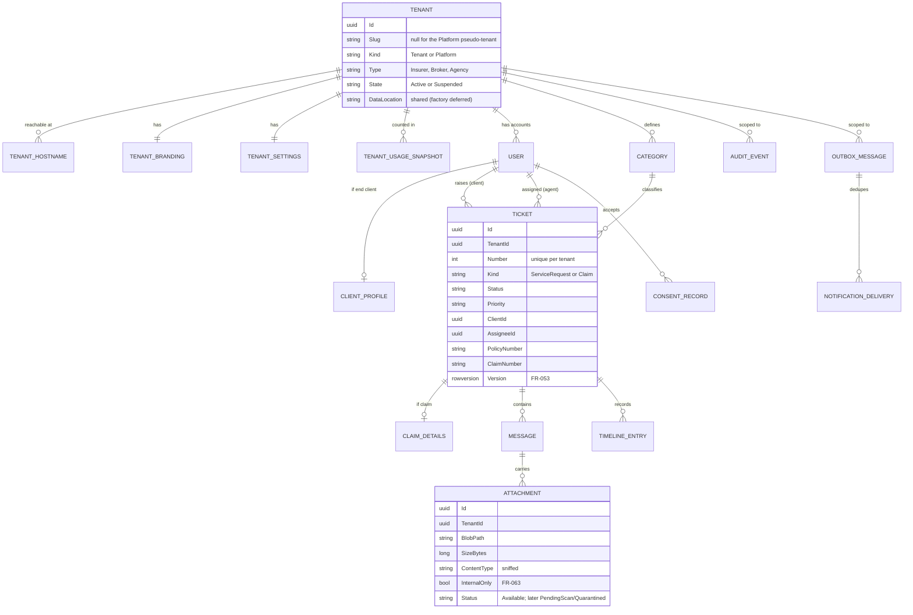
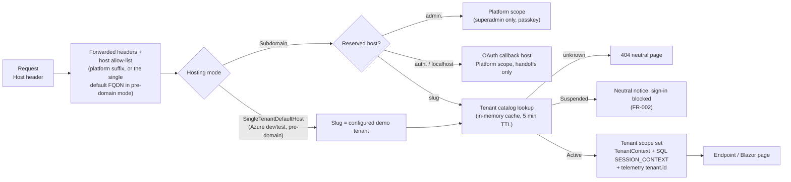
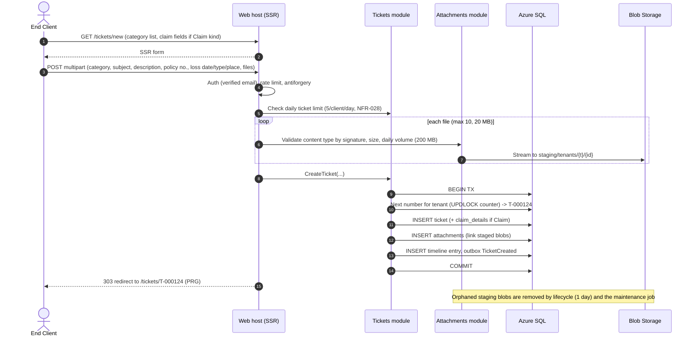
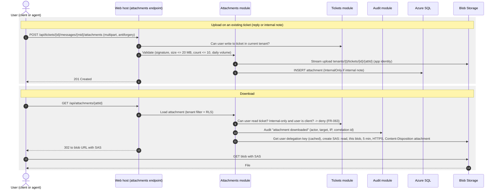
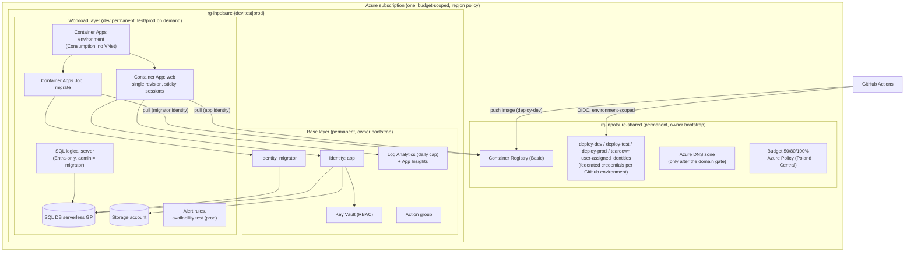
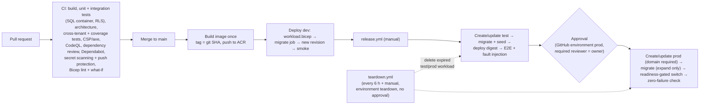

# InPolsure: Architecture

| | |
|---|---|
| **Product** | InPolsure. The repository is still named `AzurePet`. |
| **Status** | **Draft v2.1**, revised after the architecture review and the compliance re-review (phase 3). All ADRs 0001–0017 were **Accepted** by the user on 2026-10-01 (with PLAN v3.1 and REQUIREMENTS v2.2). |
| **Phase** | 3: Architecture review (revision) → 4: Architecture decisions |
| **Owner** | solution-architect |
| **Last updated** | 2026-10-01 |
| **Inputs** | [`PLAN.md`](PLAN.md) v3.1 (**approved**), [`REQUIREMENTS.md`](REQUIREMENTS.md) v2.2 (**approved**), architecture-compliance review of v1 and re-review of v2, user decisions of 2026-10-01 |
| **Decisions** | [`architecture/decisions/`](architecture/decisions/README.md) (ADR-0001 to ADR-0017) |

This document describes **how** InPolsure meets the requirements. Every
component traces to a requirement ID (`FR-xxx`, `NFR-xxx`, `C-xx`); the
full mapping is in [Appendix A](#appendix-a-traceability). Each
significant choice is recorded in an ADR, which holds the alternatives,
trade-offs and costs. This document summarises and links to them.

Prices are approximate US list prices taken from Microsoft pricing pages
and Microsoft Learn in October 2026. Poland Central prices can differ.
Each lab that provisions a resource must check the price in the
[Azure pricing calculator](https://azure.microsoft.com/pricing/calculator/).

### Change log

| Version | Date | Changes |
|---|---|---|
| v1 | 2026-10-01 | First draft for the architecture review. |
| v2 | 2026-10-01 | Applies the user's review decisions and the reviewer's findings. **Environments:** dev permanent, test and prod on demand and deleted after use; base/workload layers (new ADR-0014). **No domain:** pre-domain mode with `<slug>.localhost` locally and one demo tenant on the default Azure hostname, blocked in prod; domain is a future gate (new ADR-0016; ADR-0003, 0007, 0011 amended). **Public repo:** GitHub environments with owner approval, environment-scoped OIDC, CodeQL, secret scanning with push protection, Dependabot (ADR-0009). **Networking:** public endpoints with Entra-only data plane (new ADR-0015). **Platform-scoped tables** and a Platform pseudo-tenant instead of an RLS-bypass role (ADR-0002). **Migrations** as a Container Apps Job inside Azure (ADR-0009). Hostname list in parameter files as the single source of truth for custom domains (ADR-0009, 0011). Identity inventory (ADR-0012). Session revalidation and circuit idle timeout (ADR-0003, 0008). Background work vs scale-to-zero (§9.9). Simplifications: Reporting folded into Tickets, no audit partitioning, `DataLocation` connection factory deferred. UI components (new ADR-0017). Brevo decided (ADR-0007). Burst throttling at ~3× accepted (ADR-0013). Budget-alert latency per Cost Management (NFR-052). Superadmin hardening (ADR-0003). Fallbacks, design-load cost line, new risks, traceability appendix, Q-A1 to Q-A6 resolved. |
| v2.1 | 2026-10-01 | Compliance re-review fixes. Unattended `teardown` identity and GitHub environment `teardown` with a custom read-and-delete role on test/prod workloads (ADR-0012, 0009, 0014). `maildrop` read grant for `deploy-dev`/`deploy-test` and the owner; E2E verifies email from `maildrop` and uses seeded pre-verified users (ADR-0012, 0009, 0007). Audit only for superadmin-initiated scope switches; `seed` on the scope-factory allow-list (ADR-0002). Tenant-admin invitation after hostname *Ready* (ADR-0002, 0011). Container Apps logs via the `azure-monitor` destination and a diagnostic setting, no `listKeys()` (ADR-0012). User decisions Q-B1 to Q-B6 recorded (§10.3); REQUIREMENTS v2.2 (reduced load-test dataset, NFR-013; C-07 credit). |

---

## 1. Overview

### 1.1 Shape of the solution

InPolsure is a **modular monolith** (ADR-0001). It is **one ASP.NET Core
(.NET 10) host** that serves the Blazor UI, a small set of HTTP endpoints
and the background workers, plus one-shot commands run as a Container
Apps Job. It runs on **Azure Container Apps** (ADR-0004) in Poland
Central.

- **One relational database** (Azure SQL Database, serverless) holds all
  tenants' data. Tenants share the schema and are separated by a
  `TenantId` column, enforced twice: EF Core query filters and
  Row-Level Security. Platform data (superadmins, platform audit) lives
  under a reserved **Platform pseudo-tenant**; a short, tested list of
  platform-scoped tables has no RLS (ADR-0002, ADR-0005).
- **Blob Storage** holds attachments, branding assets and GDPR exports.
  Downloads use short-lived, read-only user-delegation SAS links issued
  only after an authorization check (ADR-0006).
- **ASP.NET Core Identity** stores the accounts in our own database. Each
  account belongs to exactly one tenant. Google and Microsoft sign-in go
  through a central callback host. MFA is mandatory for staff;
  superadmins must use passkeys on the admin host only (ADR-0003).
- **Each tenant has its own subdomain** (`<slug>.<platform-domain>`),
  resolved from the `Host` header before any tenant data is read.
  Branding comes from validated settings only, as a per-tenant CSS file
  of custom properties (ADR-0011). **No domain is owned yet:** locally
  `<slug>.localhost` gives full multi-tenancy; Azure dev/test map the
  default Container Apps hostname to one demo tenant; prod requires a
  domain (ADR-0016).
- **Notifications** use a transactional outbox in the database. A
  background dispatcher sends emails through an `IEmailSender` port:
  Mailpit locally, a blob "mail drop" in Azure dev/test, **Brevo** SMTP
  in prod (ADR-0007).
- **Render modes:** the client portal uses Blazor Static SSR; the agent
  workspace and admin panels use Interactive Server with session
  revalidation (ADR-0008). Own accessible component set (ADR-0017).
- **Environments:** dev is permanent and scales to zero; test and prod
  are created on demand from Bicep and deleted after use (ADR-0014).
- **Delivery:** Bicep and GitHub Actions (public repository) with
  environment-scoped OIDC, owner approval for prod, migrations as a
  Container Apps Job (ADR-0009). OpenTelemetry to Application Insights
  (ADR-0010). Managed identities and Key Vault (ADR-0012). Public PaaS
  endpoints with Entra-only data-plane access (ADR-0015). Rate limits
  and abuse controls (ADR-0013).

### 1.2 Design target vs run target

The architecture is designed to **reach** the targets in REQUIREMENTS §3
(5M clients, 300 req/s, 99.9%). Day to day it **runs** on the cheapest
suitable tiers (C-06, PLAN principle 6):

| Concern | Run target (learning phase) | Design target (proven in scaling lab) |
|---|---|---|
| Environments | Dev permanent, scales to zero; test and prod exist only during labs (ADR-0014) | Permanent prod once real data exists (ADR-0014 superseded then) |
| Compute | Container Apps Consumption; dev min 0; test min 0; prod **min 1 while it exists** (2 while the SLO is measured) | 4–6 replicas with autoscale; worker split out; optional Dedicated workload profile |
| Database | Dev/test: Azure SQL serverless GP **free offer**, auto-pause. Prod: paid serverless GP, 30-day PITR | Provisioned GP 8–16 vCores or Hyperscale, zone-redundant; dedicated DB for very large tenants |
| Email | Mailpit (local), blob drop (Azure dev/test), Brevo free plan (prod) | Brevo paid volume tier |
| Hostnames | `<slug>.localhost` locally; one demo tenant on the default Azure FQDN (ADR-0016) | Tenant subdomains under the platform domain; wildcard or Front Door |
| Cost | About 5–10 USD/month without a prod lab, 20–40 USD/month with one (§9.7) | About 3,000–6,000 USD/month steady state; ≤ ~20 USD per load-test run (§9.7) |

### 1.3 Requirement traceability (summary)

| Component | Main requirements |
|---|---|
| Web host (Blazor UI and HTTP endpoints) | FR-010–FR-121, NFR-010–NFR-016, NFR-080–NFR-083 |
| Tenancy module and tenant resolution | FR-001–FR-016, FR-082–FR-083, NFR-030–NFR-033 |
| Identity and Access module | FR-020–FR-033, FR-081, NFR-025, NFR-028 |
| Tickets module (incl. Claims/FNOL and Reporting) | FR-040–FR-059, FR-090–FR-093, FR-120–FR-122, NFR-012 |
| Attachments module and Blob Storage | FR-060–FR-066, NFR-022, NFR-028 |
| Notifications module, outbox, `IEmailSender` | FR-070–FR-077, NFR-003, NFR-017 |
| Audit module | FR-100–FR-104, NFR-044 |
| Privacy module | FR-110–FR-115, NFR-040–NFR-045 |
| Container Apps Job `migrate` | NFR-074, NFR-002, FR-024 |
| Azure SQL Database | NFR-004, NFR-006, NFR-010–NFR-012, NFR-018, NFR-030–NFR-033 |
| Key Vault, managed identities | NFR-023, NFR-024 |
| Application Insights / Log Analytics | NFR-050–NFR-054, NFR-032, NFR-042 |
| Bicep, GitHub Actions, environment lifecycle | NFR-070–NFR-075, NFR-002, NFR-027, NFR-060–NFR-063 |

The per-requirement mapping is in [Appendix A](#appendix-a-traceability).

---

## 2. System context (C4 level 1)



| Actor / system | Interaction | Requirements |
|---|---|---|
| Superadmin | Uses the platform host `admin.<domain>` (locally `admin.localhost`); passkey required; no access to ticket content (support access is Later) | FR-001, FR-002, FR-024, FR-025, FR-028, FR-082, FR-083 |
| Tenant Admin, Agent | Use the tenant's host; MFA required | FR-023, FR-025, FR-080, FR-081 |
| End Client | Self-registers on the tenant's branded portal | FR-020, FR-021, FR-032, FR-040, FR-049 |
| Brevo | Outbound SMTP only, prod only; receives only ticket number, subject, link (FR-074) | FR-070–FR-075 |
| Google, Microsoft | External login for end clients (locally until the domain gate, ADR-0016) | FR-021 |

**Hosts per mode (ADR-0016):** with a domain, tenants use
`<slug>.<domain>`, superadmins `admin.<domain>`, OAuth callbacks
`auth.<domain>`. Locally: `<slug>.localhost`, `admin.localhost`,
`localhost`. In Azure dev/test before the domain gate: the default
Container Apps FQDN serves one demo tenant; there is no admin or auth
host there.

There are no integrations with tenants' policy or claims systems (A-01).

---

## 3. Containers (C4 level 2)

A C4 *container* is a separately runnable unit. To keep the monolith
simple, the **Blazor UI**, the **HTTP API** and the **background worker**
are logical containers inside one ASP.NET Core process and one container
image (ADR-0001). The same image also runs as the **`migrate` Container
Apps Job** for one-shot commands. The worker can run as a second
Container App from the same image once a trigger in §3.2 fires.



### 3.1 Container responsibilities

| Container | Technology | Responsibility | ADRs | Requirements |
|---|---|---|---|---|
| Blazor UI | Blazor Web App, .NET 10, render modes per area | Client portal, agent workspace, tenant admin and superadmin panels, Identity pages | 0008, 0011, 0017 | FR-010, FR-040–FR-050, FR-080–FR-083, NFR-016, NFR-080, NFR-081 |
| HTTP API | ASP.NET Core minimal APIs, same host | Streamed attachment upload, authorised download redirect, per-tenant theme CSS and logo, health endpoints, OAuth handoff redemption, session refresh. No separate public API in MVP. | 0006, 0003, 0011 | FR-060–FR-062, FR-014, FR-031, NFR-051 |
| Background worker | `IHostedService` in the same host | Outbox dispatch (email), GDPR export build, maintenance (outbox cleanup, staging-blob cleanup, usage snapshots, audit purge) | 0007, §9.9 | FR-075, FR-082, FR-102, FR-112, NFR-003, NFR-017, NFR-043 |
| `migrate` job | Container Apps Job, same image, manual trigger | EF Core migrations per module, grants script, `seed` (not in prod), `bootstrap-superadmin` | 0009, 0012 | NFR-074, NFR-002, FR-024 |
| Database | Azure SQL Database serverless GP | All relational data, outbox, audit events, Identity store | 0002, 0005 | NFR-004, NFR-006, NFR-010–NFR-012, NFR-030 |
| Blob Storage | StorageV2, private containers, shared key disabled | Attachments, branding assets, export packages, Data Protection key ring, `maildrop` (dev/test) | 0006, 0012 | FR-060–FR-066, NFR-022 |
| Key Vault | Standard, RBAC, base layer | Data Protection key-wrapping key; Brevo and OAuth credentials in prod after the domain gate | 0012 | NFR-023 |
| Email | `IEmailSender`: Mailpit / blob drop / Brevo | Delivers notification and account emails | 0007, 0016 | FR-070–FR-074 |
| Monitoring | OpenTelemetry → Application Insights (workspace-based) | Logs, traces, metrics, availability tests, alerts | 0010 | NFR-050–NFR-054 |

### 3.2 Evolution triggers for the containers

| Step | Trigger (measured or stated) | Change |
|---|---|---|
| Split worker into its own Container App | Email peak (300/min design) or export jobs raise web p95 above NFR-010/NFR-011, or worker needs a different scaling rule | Deploy the same image with `Roles=Worker`; set `Roles=Web` on the web app |
| Maintenance as a scheduled Container Apps Job | Worker split, or a maintenance run takes long enough to affect web latency | Same image with a `maintenance` command on a cron schedule (§9.9) |
| Add Azure Service Bus between outbox and consumers | More than one consumer type per event, or outbox polling becomes a measurable DB load | Outbox relays to a Service Bus queue/topic (ADR-0007) |
| Add a public integration API | Integration API (PLAN Later scope) approved | Versioned minimal API with OAuth client credentials; separate ADR |
| Add Azure SignalR Service | Circuits per replica exceed the limit measured in the scaling lab, or sticky sessions block even scale-out | Offload circuits (ADR-0008) |
| Move agent workspace to Interactive WebAssembly | Circuit cost or latency measured as a problem | Same components with a WASM render mode; API endpoints for workspace data (ADR-0008) |
| Split Reporting out of Tickets | A report spans modules (e.g. FR-093) or needs its own read model | Reporting module with its own projections (ADR-0001) |

---

## 4. Modules and responsibilities (C4 level 3)

Seven modules plus a shared kernel (ADR-0001):

| Module | Responsibilities | Owns data (schema) | Requirements |
|---|---|---|---|
| **Tenancy** | Tenant catalog (slug, type, state, hostnames, `DataLocation`), tenant resolution, tenant settings (reopen window, abuse limits), branding settings and asset metadata, superadmin tenant management, usage snapshots | `tenancy` | FR-001–FR-007, FR-010–FR-016, FR-080, FR-082–FR-085 |
| **Identity & Access** | Accounts (ASP.NET Core Identity, tenant-scoped; superadmins under the Platform pseudo-tenant), registration, email verification, external login and handoff, MFA and passkeys, roles, staff invitations, session policies and revalidation, authorization policies, account deactivation | `identity` | FR-020–FR-033, FR-081, NFR-025 |
| **Tickets** (incl. **Claims/FNOL** and **Reporting**) | Categories, tickets, numbering, status state machine, assignment, messages (public and internal), timeline, claim details, claim number, queue queries, **tenant dashboard queries** (FR-090) | `tickets` | FR-040–FR-059, FR-090–FR-093, FR-120–FR-122, NFR-012 |
| **Attachments** | Upload validation (type by content, size, count, quotas), blob storage, download authorization and SAS issuance, attachment status (later: scan) | `attachments` | FR-060–FR-066, NFR-028 |
| **Notifications** | Consumes integration events from the outbox, decides recipients, renders branded templates, sends through `IEmailSender`, deduplicates deliveries | `notifications` | FR-070–FR-077, NFR-003, NFR-017 |
| **Audit** | Append-only audit event store, write API for other modules, retention purge procedure, query for the Later audit viewer | `audit` | FR-100–FR-104, NFR-044 |
| **Privacy** | Consent records (privacy notice and terms version), data export and erasure orchestration across modules | `privacy` | FR-110–FR-115, NFR-043 |
| *Shared kernel* | Tenant context and scopes (`ITenantScopeFactory`), current user, clock, outbox writer, result types, integration event contracts | `platform` (outbox) | NFR-031, NFR-050 |

**Changes from the module list proposed for the architecture phase:**

1. **Claims/FNOL is part of Tickets.** A claim is a ticket in a *Claim*
   category with extra fields (FR-120, FR-121). It shares the lifecycle,
   queue, timeline, numbering and concurrency rules. It is a sub-area
   (`Tickets/Claims`) with its own 1:1 `ClaimDetails` table. Trigger to
   split: claim-specific workflows (FR-122, adjudication-like steps).
2. **Reporting is part of Tickets** (changed in v2). The only MVP report
   (FR-090) is a set of read queries over tickets, so it is a sub-area
   `Tickets/Reporting`; no cross-module SQL views are needed. Trigger to
   split in §3.2.
3. **"Admin" is a UI area, not a module.** The tenant admin and
   superadmin panels are screens over Tenancy, Identity and Tickets.
   **Privacy** is a module because it orchestrates export and erasure
   across modules (FR-112, FR-113).

### 4.1 Module rules (ADR-0001)

- Each module is one .NET project with a **public contract** (commands,
  queries, integration events, DTOs) and an **internal** implementation.
  Other modules use only the contract.
- Each module has its **own EF Core `DbContext` and SQL schema** in the
  shared database. Modules do not join across schemas; they read each
  other's data through query contracts.
- Cross-module side effects (e.g. "ticket created → email") go through
  **integration events written to the outbox** in the same transaction
  as the state change (ADR-0007).
- Scope switches between tenants happen only through
  `ITenantScopeFactory`, used by an allow-list of callers (ADR-0002).
- Architecture tests in CI enforce the dependency rules, the
  `IgnoreQueryFilters()` ban and the scope-switch allow-list (NFR-073).

### 4.2 Component view: Tickets module (example)



### 4.3 Data model (logical, MVP)



Notes:

- **Table classes (ADR-0002).** *Tenant-scoped* tables (all `identity`,
  `tickets`, `attachments`, `notifications`, `privacy` tables,
  `tenancy.TenantBranding`, `tenancy.TenantSettings`,
  `audit.AuditEvents`) carry a non-null `TenantId` with EF filters and
  RLS. Superadmin accounts and platform audit events use
  `TenantId = PlatformTenantId`. *Platform-scoped* tables without RLS,
  listed in code and covered by tests: `tenancy.Tenants`,
  `tenancy.TenantUsageSnapshots`, `platform.OutboxMessages`,
  `identity.ExternalLoginHandoffs`.
- Indexes on tenant-scoped tables lead with `TenantId`, so queries for
  the largest tenant (about 3M tickets, NFR-012) stay within one key
  range.
- Ticket numbers come from a per-tenant counter row, updated under a row
  lock in the same transaction (FR-042).
- Optimistic concurrency uses `rowversion` (FR-053).
- Times are stored in UTC and shown in Europe/Warsaw time (NFR-083).
- **Agent search (FR-050, NFR-012)** uses indexed SQL queries: exact or
  prefix match on ticket number, client email, policy number and claim
  number, filters on indexed columns and keyset paging. Full-text search
  (FR-052, Later) starts with Azure SQL full-text indexes; a dedicated
  search service needs a separate ADR and a measured trigger.
- **Audit events (FR-102)** are one regular table `audit.AuditEvents`,
  **not partitioned in MVP**. The app identity has `INSERT, SELECT` and
  `DENY UPDATE, DELETE`; the 2-year retention runs through the
  `audit.usp_PurgeExpired` procedure in batches, once per tenant scope
  per day. Trigger for partitioning: purge > ~10 min or table
  > ~100 GB. Ledger tables were rejected because they forbid the
  retention delete (ADR-0005).

---

## 5. Multi-tenancy

### 5.1 Tenant resolution (FR-004, NFR-031; ADR-0011, ADR-0016)



- The tenant is resolved by **middleware before authentication**. If no
  scope exists, data access is denied (NFR-031): the connection
  interceptor refuses to open a connection and the RLS predicate returns
  no rows.
- The authentication cookie is **host-only** (no `Domain` attribute), so
  the browser never sends one tenant's cookie to another tenant's host.
  The sign-in ticket carries a `tenant_id` claim that middleware
  compares with the resolved tenant (NFR-030).
- Reserved hosts: `admin.` (superadmin panel, Platform scope), `auth.`
  (social login callback, ADR-0003), `www` and the apex. Reserved slugs
  cannot be used for tenants.
- **Pre-domain mode (ADR-0016):** in Azure dev/test the default
  Container Apps FQDN maps to one demo tenant through configuration;
  the rest of the pipeline is identical. Startup validation refuses this
  mode in prod. Locally `<slug>.localhost` gives full subdomain
  multi-tenancy without DNS (NFR-075).
- **TLS and hostnames (after the domain gate):** each tenant hostname is
  bound to the web Container App with a free managed certificate. The
  **per-environment `tenantHostnames` list in the `.bicepparam` file is
  the single source of truth**: Bicep renders the complete
  `ingress.customDomains` array and DNS records on every deployment, so
  bindings cannot be lost by the array overwrite; onboarding a hostname
  is a reviewed pull request (ADR-0009 item 5, ADR-0011). A wildcard
  binding is tested in a spike at the domain gate (managed certificates
  do not issue wildcards;
  [Microsoft Learn](https://learn.microsoft.com/azure/container-apps/custom-domains-managed-certificates)).
- Custom domains per tenant (FR-006, Later) use the same list with the
  tenant's own CNAME.

### 5.2 Data isolation (NFR-030–NFR-033; ADR-0002)

**Model: shared database, shared schema, `TenantId` discriminator,
enforced in two layers, with a Platform pseudo-tenant and a tested list
of platform-scoped tables.**

| Layer | Mechanism | Protects against |
|---|---|---|
| Scopes | Every request and job runs in exactly one scope: **Tenant**, **Platform** (`PlatformTenantId`, admin and auth hosts, dispatcher claiming) or **none** (refused). Switching only via `ITenantScopeFactory`, allow-listed callers; superadmin-initiated switches audited (FR-083), system callers traced in telemetry | Code running without, or with the wrong, tenant |
| Application | EF Core **global query filters** on every tenant-scoped entity; a `SaveChanges` interceptor stamps `TenantId` and rejects cross-tenant changes; `IgnoreQueryFilters()` banned | Developer forgetting a `WHERE TenantId = …` |
| Database | Azure SQL **Row-Level Security** filter and block predicates on `TenantId = SESSION_CONTEXT(N'TenantId')`, set read-only by a connection interceptor. Applies to all principals, including the migration identity; **no principal bypasses RLS** | Raw SQL, misuse, bugs in the application layer |
| Platform-scoped tables | Four tables without RLS (catalog, usage snapshots, outbox, OAuth handoffs), no ticket content, listed by name in code; usage snapshots are computed **inside each tenant's scope** | Needs that are cross-tenant by nature, without a bypass role |
| Storage | Blob paths prefixed `tenants/{tenantId}/…`; SAS issued per blob only after the module checks the ticket belongs to the current tenant and the user may see it | Guessable or reused file links (FR-062) |
| Background jobs | Each outbox message carries `TenantId`; the dispatcher handles each in its own tenant scope; maintenance iterates tenant scopes | Jobs leaking across tenants |
| Cache | Cache keys always include `TenantId` | Cross-tenant cache hits |
| Telemetry | `tenant.id` attribute on every span, log scope and metric dimension | NFR-032 |
| Tests | Cross-tenant suite (every endpoint, query, file link, export and job as tenant A against B's IDs); coverage check (every `TenantId` table is in the RLS policy or the exemption list); Platform-scope tests (platform code sees no tenant rows); exemption tests; scope-switch allow-list test. All in CI against a SQL Server container | NFR-030 regression, fail-closed proof |

**Moving a large tenant to dedicated capacity (NFR-033):** the catalog
keeps a `DataLocation` column (all `shared`). The per-tenant connection
factory is **deferred** until a move is needed; because every
tenant-owned row carries `TenantId`, a move is a filtered copy plus a
`DataLocation` switch.

**Noisy neighbours (NFR-014):** per-tenant rate and concurrency limits
with burst throttling at about 3× the tenant's normal peak (ADR-0013,
user-accepted), SQL command timeouts, and indexes that start with
`TenantId`. If the burst test fails: build the connection factory and
move the bursting tenant, then more replicas.

### 5.3 Per-tenant branding (FR-010–FR-016; ADR-0011)

- Branding is limited to **validated settings**: display name, logo,
  favicon, primary and accent colour (hex only), and texts and links
  (privacy notice, terms, support contact, footer). Tenants cannot upload
  scripts, HTML or CSS (FR-011).
- Colours are checked for **WCAG 2.1 AA contrast** against the theme's
  text colours. Failing combinations are rejected (FR-012).
- The server renders a per-tenant stylesheet `/theme.css` with only
  **CSS custom properties**; shared component styles use them
  (ADR-0017). It is cacheable (`max-age=300` plus ETag), which meets the
  5-minute propagation target (FR-014). No inline styles or scripts, so
  the CSP stays strict (NFR-026).
- Logo and favicon are stored in a private Blob container and served
  through a cached endpoint.
- Emails use the same settings, with the logo as a URL to the app
  endpoint (FR-073).
- Sign-in and registration pages are our own Blazor pages (ADR-0003),
  so they are fully branded.

---

## 6. UI architecture (ADR-0008, ADR-0017)

| Area | Host | Render mode | Why | Requirements |
|---|---|---|---|---|
| Client portal (ticket list, create ticket/FNOL, ticket detail, reply, profile) | Tenant host | **Static SSR** with enhanced navigation, enhanced forms and streaming rendering | Fastest first load on 4G (no WASM download, no circuit), stateless scale-out for 10,000 concurrent clients, works with scale-to-zero | NFR-016, NFR-080, NFR-081, FR-040, FR-049 |
| Identity pages (sign-in, register, verify, reset, MFA) | Tenant host, admin host | **Static SSR** | Cookie sign-in needs a real HTTP response (Identity template) | FR-020–FR-027 |
| Agent workspace (queue, filters, ticket detail, assign, status, internal notes) | Tenant host | **Interactive Server** (per page) | Rich interactivity in C# with no separate API and no ticket JSON in the browser; ≤ ~3,000 concurrent circuits at design load | FR-047, FR-048, FR-050, FR-053, NFR-010 |
| Tenant admin panel | Tenant host | **Interactive Server** | Forms and grids; low concurrency | FR-080, FR-081, FR-090 |
| Superadmin panel | Admin host only | **Interactive Server** | Low concurrency | FR-082, FR-083 |

- The render mode is set **per page or per layout area**. The app-wide
  default is Static SSR; only staff areas opt into `InteractiveServer`.
- **Sessions in circuits (ADR-0003, ADR-0008):** staff and admin areas
  use a **revalidating authentication state provider** (every 1 minute:
  security stamp, account active, tenant *Active*) and a **circuit idle
  timeout** that forces sign-out after the role's idle period (staff 30
  min, superadmin 15 min). Deactivation, role changes and suspension
  reach open circuits within about a minute (FR-002, FR-023, FR-031,
  FR-081). A small static JS module refreshes the cookie's sliding
  expiry while the user is active.
- **Circuit limits:** small circuit state, `IDbContextFactory` per
  operation, short disconnected-circuit retention, SignalR hub limits
  (message size, parallel invocations), max 5 circuits per user. HTTP
  rate limits do not see messages inside a circuit (ADR-0013).
- **File uploads in the portal** go through a plain multipart form post
  to the attachments endpoint, streamed to Blob Storage. In the agent
  workspace, uploads use `InputFile` streaming to the same module
  service.
- **Container Apps sticky sessions** keep a circuit on one replica; they
  require single-revision mode
  ([Microsoft Learn](https://learn.microsoft.com/azure/container-apps/sticky-sessions)),
  which ADR-0004 uses.
- **UI to backend:** pages call module contracts in-process (same host).
  No separate API layer and no shared DTO assembly for a remote client.
  If the agent workspace moves to WebAssembly (trigger in §3.2), the
  module contracts become the shared contract project.
- **Components (ADR-0017):** an own small component set on semantic HTML,
  built-in `EditForm`/`Input*` components and QuickGrid; no third-party
  component library in MVP. Every component must work in Static SSR
  (portal), under the strict CSP, pass axe checks (WCAG 2.1 AA,
  NFR-080) and be themed only through the brand custom properties.

---

## 7. Key flows

### 7.1 Client registration with email and password (FR-020, FR-022, FR-032, FR-110)

```mermaid
sequenceDiagram
    autonumber
    actor C as End Client
    participant W as Web host (tenant host)
    participant ID as Identity module
    participant PR as Privacy module
    participant DB as Azure SQL
    participant OB as Outbox dispatcher
    participant EM as IEmailSender (Mailpit / blob drop / Brevo)

    C->>W: GET /account/register (Host: acme.<suffix>)
    W->>W: Resolve tenant "acme" (Active), tenant scope
    W-->>C: Branded SSR form (relationship, privacy notice vX, terms vY)
    C->>W: POST form (email, password, relationship, consent)
    W->>W: Rate limit (per IP), antiforgery, validation
    W->>ID: Register(tenant=acme, email, ...)
    ID->>DB: BEGIN TX
    ID->>DB: INSERT user (TenantId=acme, unique per tenant+email)
    ID->>PR: Record consent (notice vX, terms vY, UTC time)
    PR->>DB: INSERT consent_record
    ID->>DB: INSERT outbox AccountRegistered (verification token ref)
    ID->>DB: INSERT audit_event (account created)
    ID->>DB: COMMIT
    W-->>C: "Check your email" page
    OB->>DB: Claim pending outbox rows (UPDLOCK, READPAST)
    OB->>EM: Send branded verification email (link only), in tenant scope
    OB->>DB: Mark delivered (dedupe key = event + recipient)
    EM-->>C: Verification email
    C->>W: GET /account/confirm?token=...
    W->>ID: ConfirmEmail
    ID->>DB: UPDATE EmailConfirmed = 1
    W-->>C: Signed in; can now create tickets (FR-020)
```

The same email address registering on another tenant's host creates a
separate account with its own password (FR-022), because user uniqueness
is scoped to `(TenantId, NormalizedEmail)`.

### 7.2 Client registration or sign-in with Google or Microsoft (FR-021; ADR-0003, ADR-0016)

Google and Microsoft do not accept wildcard redirect URIs, and
registering one per tenant host does not scale. Social login therefore
uses one central callback host, followed by a one-time handoff to the
tenant host. Before the domain gate this flow runs **locally only**
(auth host `localhost`, tenant hosts `<slug>.localhost`); in Azure
dev/test it is switched off (ADR-0016).

```mermaid
sequenceDiagram
    autonumber
    actor C as End Client
    participant T as Tenant host (acme.<suffix>)
    participant A as Auth host (auth.<suffix> / localhost)
    participant G as Google / Microsoft
    participant DB as Azure SQL

    C->>T: Click "Continue with Google"
    T->>T: Create data-protected login-request token<br/>(tenant=acme, returnUrl, nonce, 5 min)
    T-->>C: 302 to auth host /external/start?req=token
    C->>A: GET /external/start?req=token
    A->>A: Validate token; carry it in protected OAuth state
    A-->>C: 302 to Google (redirect_uri = auth host /signin-google)
    C->>G: Authenticate, consent
    G-->>C: 302 auth host /signin-google?code=...&state=...
    C->>A: Callback
    A->>G: Exchange code, validate id_token, state, nonce
    A->>DB: INSERT identity.ExternalLoginHandoffs (Platform scope,<br/>TargetTenantId=acme, encrypted payload, 60 s, single use)
    A-->>C: 302 acme.<suffix>/account/external-complete?code=...
    C->>T: GET with handoff code
    T->>DB: Redeem once (must match TargetTenantId = acme)
    alt Existing link in tenant acme
        T->>T: Sign in (host-only cookie)
    else New client
        T-->>C: Branded form (relationship, consent) then create tenant-local account
    end
```

The auth host never sets a session cookie for a tenant and never reads
tenant-scoped data; it writes and reads only the platform-scoped handoff
table (ADR-0002).

### 7.3 Raise a ticket or FNOL (FR-040, FR-042, FR-120, NFR-028)



### 7.4 Agent reply and email notification (FR-048, FR-071, FR-075, NFR-003, NFR-017)

```mermaid
sequenceDiagram
    autonumber
    actor A as Agent
    participant UI as Agent workspace (Interactive Server)
    participant TK as Tickets module
    participant DB as Azure SQL
    participant OB as Outbox dispatcher (hosted service)
    participant NT as Notifications module
    participant EM as IEmailSender
    actor C as End Client

    A->>UI: Write public reply, set status "Waiting for client"
    UI->>TK: AddMessage(ticket, public, expectedVersion)
    TK->>DB: BEGIN TX
    TK->>DB: UPDATE ticket ... WHERE Version = expected
    alt Version changed (FR-053)
        TK-->>UI: Conflict, show "ticket changed, reload"
    else OK
        TK->>DB: INSERT message, timeline entries
        TK->>DB: INSERT outbox MessageAdded, StatusChanged (TenantId, EventId)
        TK->>DB: COMMIT
        TK-->>UI: Updated ticket
    end
    TK-)OB: In-process signal (wake up)
    OB->>DB: Claim batch (UPDLOCK, READPAST, lease 5 min)
    OB->>NT: Handle(MessageAdded) in the message's tenant scope
    NT->>DB: Skip if delivery (EventId, recipient) exists
    NT->>NT: Render branded template (number, subject, link only - FR-074)
    NT->>EM: Send
    alt Provider down or 429
        NT->>DB: Increment attempts, next try with exponential backoff
        Note over OB,EM: Event stays in DB; delivered after recovery (NFR-003)
    else Sent
        NT->>DB: INSERT notification_delivery, mark outbox processed
    end
    EM-->>C: "New reply on T-000124"
```

### 7.5 Attachment upload and download (FR-060–FR-063, FR-100)



### 7.6 Release with migrations (NFR-002, NFR-071, NFR-074; ADR-0009, ADR-0014)

```mermaid
sequenceDiagram
    autonumber
    actor O as Owner
    participant GH as GitHub Actions (release.yml)
    participant AZ as Azure Resource Manager
    participant J as Container Apps Job migrate (migrator identity)
    participant SQL as Azure SQL
    participant APP as Container App web (app identity)

    O->>GH: Run release (digest from dev, expiresAt)
    GH->>AZ: OIDC login as deploy-test (environment test)
    GH->>AZ: Deploy workload.bicep (create or update test)
    GH->>J: az containerapp job start (migrate, then seed)
    J->>SQL: Apply expand-only migrations, grants script (Entra auth)
    J-->>GH: Succeeded
    GH->>APP: Update to digest; new revision
    APP-->>GH: Readiness passed, traffic switched
    GH->>GH: E2E + fault-injection tests
    GH->>O: Approval request (environment prod, required reviewer)
    O->>GH: Approve
    GH->>GH: Fail fast if no platform domain (ADR-0016)
    GH->>AZ: OIDC login as deploy-prod; deploy workload.bicep (prod)
    GH->>J: Start migrate (and bootstrap-superadmin if new)
    J->>SQL: Expand-only migrations
    GH->>APP: Update to digest; readiness-gated switch
    GH->>GH: Synthetic zero-failure check during deploy (NFR-002)
```

---

## 8. Deployment view (ADR-0004, ADR-0009, ADR-0014)

### 8.1 Azure resources per environment



| Container | Azure resource | Dev (permanent) | Test (on demand) | Prod (on demand, after domain gate) |
|---|---|---|---|---|
| Web host (UI, API, worker) | Container App, Consumption | 0.5 vCPU / 1 GiB, min 0, max 1 | same, min 0, max 2 | 0.5–1 vCPU / 1–2 GiB, **min 1 whenever prod exists** (2 while the SLO is measured), max 5 |
| One-shot commands | Container Apps Job `migrate` | yes | yes | yes (`seed` refused) |
| Worker (when split) | Second Container App, same image | — | — | min 1 |
| Database | Azure SQL serverless GP | **Free offer**, auto-pause 15 min, 7-day PITR | Free offer | **Paid serverless**, auto-pause 60 min (off while SLO measured), 30-day PITR |
| Blob Storage | StorageV2, hot, private, shared key disabled | LRS | LRS | ZRS, soft delete 30 days, versioning |
| Secrets | Key Vault Standard (base layer) | DP key | DP key | DP key, Brevo, OAuth |
| Telemetry | Log Analytics + App Insights (base layer) | cap 0.05 GB/day | cap 0.05 GB/day | cap 0.1 GB/day, 30-day retention |
| Hostname | Default FQDN (ADR-0016) | demo tenant | demo tenant | tenant subdomains (`tenantHostnames`) |
| Images | ACR Basic (shared) | shared | shared | shared |

Identities and their roles per environment are listed once, in
ADR-0012 §1.

**Region verification (C-05, NFR-040):** Poland Central has 3
availability zones and no paired region
([Microsoft Learn: regions list](https://learn.microsoft.com/azure/reliability/regions-list)).
Azure SQL serverless is available there, with up to 80 vCores but without
zone support at 80 vCores
([Microsoft Learn: SQL feature availability by region](https://learn.microsoft.com/azure/azure-sql/database/region-availability#serverless-region-availability)).
Container Apps is reported as operating in Poland Central by the
per-region status feed
([statusfield](https://statusfield.com/services/microsoft-azure-europe/azure-container-apps/azure-container-apps-poland-central));
the first deployment lab confirms it with `az provider show -n
Microsoft.App` and the workload-profile list. Hyperscale
*premium-series* hardware is not listed for Poland Central; Hyperscale
standard-series is the scale-up path. Fallbacks are in §8.3.

### 8.2 Environments (ADR-0014)

| Env | Purpose | Lifetime | Deployed by | Data | Hostname mode |
|---|---|---|---|---|---|
| local | Development, full multi-tenancy, social login, Mailpit | Developer machine | Developer | Seed | `Subdomain` on `*.localhost` |
| dev | Integration of `main`, smoke tests | **Permanent**, scales to zero | `cd-dev.yml` on merge | Synthetic seed, kept | `SingleTenantDefaultHost` until the domain gate |
| test | Pre-prod verification, E2E, fault injection | **On demand**, default expiry 3 days | `release.yml`; `teardown.yml` | Re-seeded on creation | Same as dev |
| prod | SLO measurement, zero-downtime check, restore drill, real email | **On demand**, default expiry 7 days; **requires the domain gate** | `release.yml` after owner approval; `teardown.yml` | Synthetic, handled as real; not kept between windows | `Subdomain` only (validated at startup) |
| loadtest | Scaling lab (NFR-013, NFR-014) | Hours | `loadtest.yml` (Later) | Synthetic; full design dataset (100 tenants × 50,000 clients) if it fits the 20 USD cap, otherwise a reduced dataset with documented extrapolation to design load (NFR-013 v2.2, Q-B3) | `Subdomain` or test hosts |

Teardown deletes only the workload layer of expired test/prod
environments, every 6 hours and on demand. Identities, Key Vault and
telemetry survive (ADR-0014).

**Networking (ADR-0015):** all PaaS endpoints are public; data-plane
access is **Entra-only** through managed identities (SQL authentication
disabled, storage shared key disabled, Key Vault RBAC, ACR admin user
disabled). No private endpoints in MVP. Triggers to revisit: before any
real personal data, a tenant contract or regulator expectation, a
security finding, or prod becoming permanent; then VNet, private
endpoints and Front Door with WAF, prod only.

### 8.3 Fallbacks (C-05, C-06)

| If… | Then | Cost impact | Where decided |
|---|---|---|---|
| Container Apps or workload profiles unavailable in Poland Central | (1) Consumption-only environment; (2) App Service in Poland Central: dev B1, test/prod P0v3 with a staging slot, on demand; (3) all resources in another EU region as a documented NFR-040 exception | (1) none; (2) dev +~13 USD/month, test/prod ~0.1 USD/hour while they exist; (3) none | ADR-0004 |
| Container Apps **free grant exhausted** (180,000 vCPU-s, 360,000 GiB-s, 2M requests per subscription per month; [Microsoft Learn](https://learn.microsoft.com/azure/container-apps/billing)) | Keep running; usage is billed at about 0.054 USD per active hour for a 0.5 vCPU / 1 GiB replica; the budget alerts and the scale-to-zero settings limit exposure | About 1–5 USD/month more at run load | ADR-0004 |
| SQL **free offer not available** in Poland Central for this subscription (region is fixed by the first free DB) | Dev/test on paid serverless GP with auto-pause, or DTU Basic (2 GB, ~5 USD/month each) | About +5–15 USD/month for dev and test | ADR-0005 |
| SQL free offer **exhausted mid-month** (100,000 vCore-s ≈ 55 h at 0.5 vCore) | Dev/test auto-pause until next month (configured behaviour); if a lab needs it, recreate test on paid serverless for that window | 0, or a few USD for the window | ADR-0005 |
| Brevo free plan unsuitable (EU storage terms; or branding on emails once a real tenant uses prod; branding is accepted during the learning phase, user decision Q-B4) | Brevo's cheapest paid tier or Mailjet behind the same `IEmailSender` | About 10–25 USD/month while prod exists | ADR-0007 |
| Defender for Storage malware scanning not offered in Poland Central | ClamAV container as a Container Apps Job | Compute only, cents per run | ADR-0006 |

---

## 9. Cross-cutting concerns

### 9.1 Security (NFR-020–NFR-028)

| Threat / need | Control | ADR |
|---|---|---|
| Cross-tenant access | Scopes, two-layer isolation (EF filters + RLS, no bypass principal), host-only cookies, tenant claim check, cross-tenant and coverage tests | 0002, 0011 |
| Account takeover of staff | Mandatory MFA (TOTP or passkey), lockout, idle timeout 30 min (FR-031), revalidation of open circuits, audit of sign-ins | 0003, 0008 |
| Takeover of a superadmin account | **Passkey required** (no TOTP), sign-in only on the admin host, idle timeout 15 min, absolute 8 h, **security email to all superadmins and an audit event on every superadmin sign-in**, creation only by another superadmin or the bootstrap job; Entra workforce tenant as the evolution step | 0003, 0010 |
| Credential stuffing and fake registrations | Per-IP and per-account rate limits, Identity lockout, verified email before the first ticket, per-client daily limits; CAPTCHA Later | 0013 |
| XSS via branding | No tenant HTML/CSS/scripts; strict CSP (`script-src 'self'; style-src 'self'`); theme only via validated CSS variables; components that respect the CSP | 0011, 0017 |
| CSRF | Antiforgery on all form posts and upload endpoints; SameSite=Lax cookies | 0008 |
| Guessable or shared file links | Authorization check, audit, 5-minute user-delegation SAS for one blob; storage shared key disabled | 0006 |
| Malicious uploads | Content-signature check, type allow-list, size limits; **malware scanning deferred** (A-09), Defender for Storage planned before real data | 0006 |
| Secrets leakage (public repository) | Managed identities for SQL, Blob, Key Vault, ACR; remaining third-party secrets in Key Vault; **GitHub secret scanning with push protection**; no secrets in GitHub at all (OIDC) | 0012, 0009 |
| Malicious pull requests against a public repo | Least-privilege workflow `permissions`, actions pinned by SHA, no `pull_request_target` with PR code, approval for first-time contributors' workflows, no OIDC/env secrets for forks; prod token only after owner approval | 0009 |
| Vulnerable dependencies and code | Dependabot, dependency review, `dotnet list package --vulnerable`, CodeQL; high/critical block release | 0009 |
| Exposed PaaS endpoints | Entra-only data plane, no keys, TLS 1.2+; private endpoints at the ADR-0015 triggers | 0015 |
| Transport | HTTPS only, TLS 1.2+, HSTS (NFR-021) | 0004 |
| Encryption at rest | Platform encryption on SQL (TDE) and Storage; backups encrypted (NFR-022) | 0005, 0006 |
| Least privilege (NFR-024) | `app` identity: data read/write, no DDL, audit `DENY`s; `migrator` only on the job; deploy identities without data-plane rights; no standing human data-plane access in test/prod (break-glass assignment, Activity Log) | 0012 |

Security headers (CSP, HSTS, `X-Content-Type-Options`, `Referrer-Policy`,
`Permissions-Policy`, `frame-ancestors 'none'`) are set by middleware and
checked by a header scan in the pipeline (NFR-026).

### 9.2 GDPR and privacy (NFR-040–NFR-045, FR-110–FR-115)

- **Residency:** all Azure resources in Poland Central (NFR-040, enforced
  by Azure Policy). **Brevo** is a sub-processor outside Azure; EU
  storage of transactional data and the DPA terms are verified before
  the first prod send (ADR-0007). Backups stay in-region (LRS/ZRS);
  cross-region copies are deferred (A-12).
- **Minimisation:** no national ID numbers (NFR-045). Emails contain no
  ticket content (FR-074). Telemetry holds only pseudonymous IDs
  (NFR-042), with redaction for email addresses and free text.
- **Special-category data (NFR-041):** ticket content and attachments
  are visible only through FR-028 authorization; downloads are audited.
- **Consent:** version and time of the privacy notice and terms accepted
  are stored (FR-110).
- **Export (FR-112):** a resumable worker job collects profile, tickets,
  messages and attachments into a ZIP in the `exports` container; the
  tenant admin downloads it through a 15-minute SAS; a lifecycle rule
  deletes exports after 7 days. Target ≤ 24 h (NFR-043).
- **Erasure (FR-113):** profile data is deleted; client-written ticket
  content deleted or anonymised; attachments and their versions deleted;
  audit events keep only pseudonymous IDs. Soft-deleted blobs and
  database backups expire within 30 days.
- **Breach assessment (NFR-044):** audit events are in SQL and queryable
  immediately; telemetry is in Log Analytics within minutes.
- **Roles:** the tenant is the controller, the platform owner the
  processor (A-08); Azure and Brevo are sub-processors.

### 9.3 Observability (NFR-050–NFR-054; ADR-0010)

- OpenTelemetry SDK in the host (ASP.NET Core, HttpClient, SQL client,
  EF Core, runtime) plus custom spans and metrics for the outbox,
  tickets, auth and circuits. Exported with the Azure Monitor
  OpenTelemetry Distro to workspace-based Application Insights per
  environment, in the **permanent base layer**, so prod telemetry
  survives prod's teardown.
- Correlation: W3C trace context; every log carries `TraceId`,
  `tenant.id` and a pseudonymous `user.id`; the outbox stores the
  originating trace context (NFR-050).
- Health: `/health/live` and `/health/ready` (database check with a
  cached result in prod; no DB check in dev/test so probes do not keep
  the serverless database awake) (NFR-051).
- Alerts (NFR-052) in two latency classes: **technical ≤ 5 min**
  (availability test, 5xx rate, outbox failed or older than 10 min, SQL
  free amount, Log Analytics cap) and **budget, hours** (Cost Management
  data arrives 8–24 h after usage and budgets are evaluated about daily;
  the 6-hourly teardown is the fast guard). Every superadmin sign-in
  raises a security email and a metric.
- Availability test exists exactly while prod exists; the SLO report
  covers only that time (A-11).
- Dashboards (NFR-053): Azure Workbooks for SLO, per-tenant traffic and
  errors, outbox health, cost.
- Local: the .NET Aspire dashboard (OTLP) (NFR-075).

### 9.4 CI/CD and environments (NFR-070–NFR-075; ADR-0009, ADR-0014)



- The repository is **public**: GitHub environments with protection
  rules, CodeQL, dependency review, secret scanning with push protection
  and Dependabot are available at no cost; standard runners are free.
- GitHub Actions authenticate to Azure with **OIDC federated
  credentials** whose subject is the GitHub **environment**
  (`repo:<owner>/<repo>:environment:<env>`), one deploy identity per
  environment, scoped to that environment's resource group. The prod
  deploy token can be obtained only after the owner approves.
  `teardown.yml` uses a separate **`teardown` identity** in GitHub
  environment `teardown` (no reviewer, `main` only) with a custom
  read-and-delete role for workload resources in test and prod, so a
  forgotten prod is removed unattended (ADR-0012 §1, ADR-0014 §4).
- **Email in test** is verified from the `maildrop` container: the E2E
  job reads it with the `deploy-test` identity (*Storage Blob Data
  Reader* on that container only), follows verification links, and
  uses seeded pre-verified users where no link is needed (ADR-0009
  item 6, FR-020, NFR-003).
- The same image digest is promoted through dev, test and prod.
- **Migrations run as the Container Apps Job `migrate`** inside Azure
  with the `migrator` identity; GitHub runners never connect to SQL.
  **Expand/contract:** additive changes in release N, destructive
  changes in N+1 or later, so revision N−1 keeps working during the
  switch and after a rollback (NFR-074, NFR-002).
- **Custom domains:** the `tenantHostnames` list in each parameter file
  is the single source of truth for `ingress.customDomains` (empty until
  the domain gate).
- Zero-downtime deploys: single-revision mode moves traffic after the
  readiness probe passes; Interactive Server circuits reconnect to the
  new revision (risk R-05).

### 9.5 Resilience and failure modes

| Failure | Behaviour | Requirement |
|---|---|---|
| Email provider down / throttling | Outbox retries with backoff and jitter; alert when messages are older than 10 min; no user action fails | FR-075, NFR-003 |
| Database auto-paused (dev/test; prod between uses unless the SLO is measured) | First connection waits while the database resumes; EF Core retry strategy and a "starting up" page | NFR-001 (dev/test have no target) |
| Replica crash or deploy | Container Apps restarts it; prod keeps ≥ 1 replica (2 while the SLO is measured); expired outbox leases are reclaimed; Interactive Server users reconnect | NFR-001, NFR-003 |
| Replica scaled to zero (dev/test) with pending work | Work resumes on the next wake-up (restartable handlers, catch-up of maintenance) | §9.9 |
| Concurrent edits | rowversion conflict → user told to reload | FR-053 |
| Blob Storage unavailable | Upload and download fail with a clear message; ticket text flows continue | NFR-001 (core flows exclude files) |
| Tenant burst (FNOL surge) | Bursting tenant throttled above ~3× its normal peak with 429 and "try again"; other tenants unaffected | NFR-014, ADR-0013 |
| Zone outage | SQL (non-zone-redundant at run load) and ACA (no VNet, not zone-redundant) may be unavailable; accepted at run load; design target enables zone redundancy | NFR-001 design |
| Region outage | Not covered (no paired region, A-12); RTO 4 h means rebuilding from Bicep and restoring in Poland Central once it recovers | NFR-005 |
| Prod deleted (between windows) | By design; excluded from the SLO and recorded (A-11) | NFR-001 |

### 9.6 Backup and DR (NFR-004–NFR-006)

| Data | Mechanism | RPO | Retention | Location |
|---|---|---|---|---|
| Azure SQL (prod) | Automated backups: full weekly, differential every 12–24 h, **log backups about every 10 minutes**; point-in-time restore ([Microsoft Learn](https://learn.microsoft.com/azure/azure-sql/database/automated-backups-overview)) | ≤ ~10 min (meets 15 min) | **PITR 30 days** on paid serverless GP | ZRS if offered for serverless GP in Poland Central, else LRS |
| Azure SQL (dev/test) | Same mechanism on the free offer | — | 7 days (free-offer limit, [Microsoft Learn](https://learn.microsoft.com/azure/azure-sql/database/free-offer)) | LRS |
| Blob attachments (prod) | Write-once blobs; **soft delete 30 days + versioning**; ZRS | 0 for accidental deletion/overwrite | 30 days for deleted data | Poland Central |
| Configuration and infra | Bicep and GitHub (NFR-070) | n/a | git history | GitHub |

**On-demand prod (ADR-0014):** backups and soft-deleted data are
deleted with prod. NFR-004 to NFR-006 are demonstrated inside a live
window: 30-day PITR configured, a point-in-time restore to a new
database, and the RTO 4 h drill (hardening lab, NFR-005). Accepted
because data is synthetic (A-07, A-11). Before real data, prod becomes
permanent and this changes.

### 9.7 Cost (NFR-060–NFR-064)

**Run load (learning phase), approximate monthly USD.** Assumption: a
prod lab month has about 40 live prod hours; months without a prod lab
have none (prod also needs the domain gate, ADR-0016).

| Item | Dev (permanent) | Test (on demand) | Prod (on demand) | Shared | Notes |
|---|---|---|---|---|---|
| Container Apps (Consumption) | 0 | 0 | 0–5 | — | Free grant per subscription: 180,000 vCPU-s, 360,000 GiB-s, 2M requests/month ([Microsoft Learn](https://learn.microsoft.com/azure/container-apps/billing)); prod ≈ 0.054 USD per replica-hour at 0.5 vCPU / 1 GiB |
| Azure SQL Database | 0 | 0 | 10–20 | — | Dev/test free offer ([Microsoft Learn](https://learn.microsoft.com/azure/azure-sql/database/free-offer)); prod paid serverless ≈ 0.52 USD per vCore-hour while active, plus storage |
| Blob Storage | <1 | <1 | <1 | — | A few GB |
| Key Vault | <1 | <1 | <1 | — | Per-operation pricing; base layer |
| Log Analytics / App Insights | 0–2 | 0–1 | 0–2 | — | 5 GB/month free per billing account, then about 2.30 USD/GB; daily caps; base layer |
| Availability test (standard) | — | — | 1–4 | — | About 0.0005 USD per execution, 1/min, only while prod exists |
| Container Registry Basic | — | — | — | ~5 | Shared |
| DNS zone + domain | — | — | — | 0 | No domain (ADR-0016); after the gate ~1.5 USD/month |
| Email | 0 (Mailpit/blob drop) | 0 | 0 (Brevo free) | — | |
| **Total** | | | | | **About 5–10 USD in a month without prod; about 20–40 USD in a month with a prod lab.** Under the 50 USD target and the 100 USD ceiling |

**Main cost risks at run load:** forgetting to end a window (capped by
`expiresAt`, max 14 days: up to about +40–80 USD for prod; guarded by
the 6-hourly teardown); probes or pollers that keep the dev/test
database awake and use up the free vCore seconds (then auto-pause until
next month); log volume above the daily cap (dropped, not billed);
private endpoints (only at the ADR-0015 triggers). Fallback costs are in
§8.3.

**Design load, steady state (100 tenants × 50,000 clients = 5M clients,
300 req/s peak, if prod ran permanently at full scale), approximate
monthly USD:**

| Item | Rough monthly USD |
|---|---|
| Container Apps: 4–6 replicas × 2 vCPU / 4 GiB (or Dedicated D4 profile) | 600–1,000 |
| Azure SQL: provisioned GP 8–16 vCores zone-redundant, or Hyperscale | 1,500–3,000 |
| Blob Storage: ~5 TB in year 1, cool tier after 30 days | 50–150 |
| Email: ~2.1M emails/month on a Brevo paid tier | 200–600 |
| Log Analytics: 5–10 GB/day with sampling | 350–700 |
| Malware scanning (Defender for Storage, per GB scanned and per account; check pricing) | 50–150 |
| Private networking and edge (ADR-0015: private endpoints, DNS, ACR Premium, Front Door Premium with WAF) | 100–450 |
| Azure SignalR Service (only if its trigger fires) | 0–150 |
| **Total** | **about 3,000–6,000 USD/month**, i.e. about **30–60 USD per tenant per month** or **0.6–1.2 USD per 1,000 registered clients per month** |

**Load-test run (NFR-063, scaling lab):** the same capacity for a few
hours only. Compute about 1–1.5 USD/hour at 6 large replicas; SQL about
4–9 USD/hour at 8–16 provisioned vCores; a 30-minute test plus warm-up is
a few USD. **Seeding** 100 tenants with 5M clients and a realistic
ticket history (3M tickets for the largest tenant, NFR-012) can take
hours of database time and is the main risk to the ≤ 20 USD per run cap
(risk R-13). If it does not fit, the run uses a reduced dataset and
documents the extrapolation to design load (NFR-013 v2.2, Q-B3).

### 9.8 Caching

- In-memory, per replica: tenant catalog, branding and settings (5-minute
  TTL, satisfies FR-014), category lists. Keys include `TenantId`.
- Output caching for `/theme.css` and logos (varies by host).
- **No Redis at MVP.** Trigger: rate-limit counters or cache invalidation
  must be consistent across replicas at design load, or measured DB load
  from repeated reads. Azure Managed Redis would then need an ADR.

### 9.9 Background work and scale-to-zero (ADR-0004, ADR-0007)

| Work | Mechanism | Dev (min 0) | Test (min 0, on demand) | Prod (min 1 while it exists) |
|---|---|---|---|---|
| Outbox dispatch (emails) | Hosted service; in-process wake-up on commit, 30 s poll **only while a replica runs**; 5-minute leases; idempotent handlers | Runs while a replica is up; messages written just before scale-in wait for the next wake-up | Same | Always running; NFR-017 (p95 ≤ 2 min) does not depend on traffic |
| GDPR export | Job table with per-step progress; resumable after restart | Resumes on wake-up | Same | Runs to completion; NFR-043 (≤ 24 h) |
| Maintenance: outbox cleanup, staging-blob cleanup, usage snapshots (FR-082), audit purge (FR-102) | Hosted service, daily, one replica via `sp_getapplock`; **catch-up on start** if the last run is older than 24 h | Runs when the replica wakes | Same | Daily |
| One-shot commands (`migrate`, `seed`, `bootstrap-superadmin`) | Container Apps Job, started by the pipeline | Yes | Yes | Yes (`seed` refused) |

Why not scheduled Container Apps Jobs for maintenance now: a cron job in
dev/test would wake the serverless database every day and spend
free-offer vCore seconds for no requirement (dev/test have no targets),
and in prod the always-on replica already runs it. **Trigger to move
maintenance into a scheduled Job:** worker split (§3.2), or a run long
enough to affect web latency; cost then is cents per run.

**Cost of prod min 1:** about 0.054 USD per hour for one 0.5 vCPU / 1 GiB
replica while active (less when idle), about 2 USD per 40-hour window,
largely inside the free grant. If prod became permanent, an idle replica
costs about 10–15 USD/month.

---

## 10. Risks and open questions

### 10.1 Risks

| # | Risk | Impact | Mitigation | Owner/when |
|---|---|---|---|---|
| R-01 | **Azure Communication Services Email is retiring** (no new customers from 23 October 2026; retirement 30 September 2028; [Microsoft Learn](https://learn.microsoft.com/azure/communication-services/acs-retirement-and-breaking-changes-guide)) | Suggested email service not viable | Brevo behind `IEmailSender` (ADR-0007) | Closed by ADR-0007 |
| R-02 | Per-tenant hostname binding in Container Apps (wildcard unverified; per-app custom-domain limit unknown) | Onboarding friction after the domain gate; limit below 250 tenants | Hostname list in parameter files (ADR-0009); wildcard spike and limit check at the domain gate; Front Door fallback (ADR-0011) | Domain-gate lab |
| R-03 | Free-offer SQL limits in dev/test (32 GB, 100,000 vCore-s, 7-day PITR) | Dev/test pause mid-month | Probe design, alert on free amount < 10%; paid fallback (§8.3). Prod uses paid serverless | Data lab |
| R-04 | Serverless auto-pause and scale-to-zero cold starts | Slow first requests in dev/test | Retry logic, startup page; prod min 1 replica and auto-pause off while the SLO is measured | Environments lab |
| R-05 | Interactive Server circuits lost on deploy or replica restart | Agents lose unsaved input | Small forms, drafts, reconnect UI; measure; WASM trigger (ADR-0008) | Environments lab |
| R-06 | RLS, EF filters or the platform-table exemption list misconfigured | Cross-tenant leak | Fail-closed scopes, coverage check, Platform-scope and exemption tests, review checklist (ADR-0002) | Multi-tenancy lab |
| R-07 | Own identity store means we own password and superadmin security | Breach responsibility | Built-in hashing, lockout, staff MFA, superadmin passkeys and sign-in alerts, ASVS review; Entra workforce trigger (ADR-0003) | Identity labs |
| R-08 | Public PaaS endpoints in MVP | Larger attack surface | Entra-only data plane, no keys; ADR-0015 triggers | Hardening lab |
| R-09 | Defender for Storage malware scanning availability in Poland Central not confirmed ([Microsoft Learn](https://learn.microsoft.com/azure/defender-for-cloud/introduction-malware-scanning)) | FR-064 may need a self-hosted scanner | Check before enabling; ClamAV job fallback | Before real data |
| R-10 | **Brevo free plan** (300 emails/day) may add Brevo branding to emails or lack needed terms; Brevo path is first used in prod | White-label emails (FR-073) or residency terms not met; late surprises | No real email outside prod (Mailpit locally, blob drop in dev/test, so the quota is never used for tests); verify EU storage and DPA before the first prod send; Brevo branding **accepted during the learning phase** (user decision Q-B4), revisited before a real tenant uses prod; paid tier or Mailjet fallback (ADR-0007) | Background-processing lab / domain gate; branding: before a real tenant |
| R-11 | Budget overrun from misconfiguration | > 100 USD | Budgets and alerts from the first deployment, daily caps, `expiresAt` teardown every 6 h, cost review per lab | All labs |
| R-12 | **Public repository** exposes code, workflows and infrastructure layout | Attackers learn the design; a leaked secret is public immediately | No secrets anywhere (OIDC, managed identities), push protection, hardened workflows (ADR-0009); security does not rely on obscurity | CI lab |
| R-13 | **Load-test cost cap (NFR-063, ≤ 20 USD per run)** may be exceeded by seeding 5M clients and years of ticket history at design-load SQL tiers | Cap breached, or the test runs on unrealistic data | Seed with bulk copy at a modest serverless size, then scale up only for the test window; keep the seeded database paused between runs of the scaling lab (storage ~0.12 USD/GB-month) or reuse it via copy; time-boxed workflow with automatic teardown; if the full dataset does not fit, **reduce the dataset and document the extrapolation to design load** (user decision Q-B3, NFR-013 v2.2); the cap stays at 20 USD per run including seeding | Scaling lab |
| R-14 | **Pre-domain divergence:** Azure dev/test do not exercise subdomain routing, superadmin sign-in, social login or real email | Defects in those paths surface only at the domain gate | Same middleware path in both modes; full coverage locally and in CI (cross-tenant suite with `Host` headers); domain-gate lab checklist (ADR-0016) | Domain-gate lab |
| R-15 | Container Apps free grant or SQL free offer unavailable or exhausted | Higher run cost | Fallbacks in §8.3 (+1–15 USD/month) | First deployment / data lab |
| R-16 | Managed certificates are re-issued each time prod is created | Slower prod creation; issuance failure blocks a window | DNS zone permanent; release workflow waits for binding; wildcard spike (ADR-0011) | Domain-gate lab |
| R-17 | **Prod is blocked until the domain gate** (ADR-0014, ADR-0016) | NFR-001 measurement, zero-downtime check in prod, restore drill in prod and real email wait for a domain | Rehearse mechanics in test; user decides when to pass the gate (Q-B1) | Environments lab |

### 10.2 Questions from v1, resolved (user decisions of 2026-10-01)

| # | Question | Answer recorded | Where |
|---|---|---|---|
| Q-A1 | Platform domain: own one or buy one? | **No purchase.** Pre-domain mode: `<slug>.localhost` locally, one demo tenant on the default Azure FQDN in dev/test, blocked in prod; social login and email tested locally; custom domain is a future gate, not a plan | A-05, ADR-0016 |
| Q-A2 | Email provider | **Brevo** (SMTP); Mailjet as alternative behind the same port | ADR-0007 |
| Q-A3 | Repository visibility and plan | **Public on GitHub**: environments with owner as required reviewer for prod, environment-scoped OIDC, CodeQL, secret scanning with push protection, Dependabot | ADR-0009 |
| Q-A4 | Prod live hours per month | **Superseded**: prod is created and deleted per lab. Cost estimates assume about 40 live hours in a month with a prod lab (architect assumption) | A-11, ADR-0014, §9.7 |
| Q-A5 | Accept public PaaS endpoints while data is synthetic? | **Yes**, with Entra-only (managed identity) data-plane access and triggers to revisit | ADR-0015 |
| Q-A6 | Superadmins on ASP.NET Core Identity? | **Yes, hardened**: passkey required, 15-minute idle timeout, sign-in alert on every superadmin sign-in, admin host only | ADR-0003 |

Other user decisions: burst throttling at ~3× accepted (ADR-0013);
budget-alert latency relaxed to Cost Management's real delay (NFR-052);
REQUIREMENTS v2.2 and PLAN v3.1 approved.

### 10.3 Questions from v2, resolved (user decisions of 2026-10-01)

| # | Question | Decision | Where recorded |
|---|---|---|---|
| Q-B1 | Prod needs a domain (ADR-0016). When a lab needs prod (SLO measurement, zero-downtime check in prod, restore drill, real email), buy a domain then, or rehearse in **test** (pre-domain) and formally defer? | **Rehearse prod-dependent labs in test**; buy a domain only when a lab needs formal prod evidence (SLO, zero-downtime in prod, restore drill, real email). R-17 stays open until then | ADR-0014, ADR-0016, R-17 |
| Q-B2 | Test also on demand (architect's extension of the prod decision), or permanent with scale-to-zero (≈ 0–2 USD/month)? | **Test on demand** | C-07 (REQUIREMENTS v2.2), ADR-0014 |
| Q-B3 | If seeding the full design dataset breaks the 20 USD load-test cap (NFR-063): cap on the test run only, or a reduced dataset with documented extrapolation? | **Reduced dataset with documented extrapolation** to design load; cap unchanged | NFR-013, NFR-012 (REQUIREMENTS v2.2), ADR-0014 §1, §8.2, R-13 |
| Q-B4 | Is Brevo free-plan branding on transactional emails acceptable during the learning phase? | **Acceptable during the learning phase**; revisit before any real tenant uses prod | ADR-0007 item 8(b), §8.3, R-10 |
| Q-B5 | Default window lengths: test 3 days, prod 7 days, maximum 14; teardown every 6 hours (A) | **Accepted as stated** | ADR-0014 |
| Q-B6 | Superadmin idle timeout 15 minutes and absolute session 8 hours (A) | **Accepted as stated** | ADR-0003 |

There are no open questions for the user in this version; the ADRs
were **Accepted** on 2026-10-01.

---

## 11. ADR index

| ADR | Title | Status |
|---|---|---|
| [0001](architecture/decisions/0001-modular-monolith.md) | Modular monolith in one ASP.NET Core host | Accepted |
| [0002](architecture/decisions/0002-tenant-data-isolation.md) | Tenant data isolation: shared database with TenantId and Row-Level Security | Accepted |
| [0003](architecture/decisions/0003-identity.md) | Identity: ASP.NET Core Identity, tenant-scoped accounts, social login, staff MFA | Accepted |
| [0004](architecture/decisions/0004-compute-hosting.md) | Compute: Azure Container Apps (Consumption) | Accepted |
| [0005](architecture/decisions/0005-relational-database.md) | Relational database: Azure SQL Database serverless GP (free offer for dev/test) | Accepted |
| [0006](architecture/decisions/0006-attachment-storage.md) | Attachments: Blob Storage with app-mediated upload and short-lived SAS download | Accepted |
| [0007](architecture/decisions/0007-background-processing-and-email.md) | Background processing: SQL outbox + in-process worker; email via Brevo | Accepted |
| [0008](architecture/decisions/0008-blazor-render-modes.md) | Blazor render modes per area | Accepted |
| [0009](architecture/decisions/0009-iac-and-cicd.md) | IaC with Bicep, CI/CD with GitHub Actions, OIDC and environment promotion | Accepted |
| [0010](architecture/decisions/0010-observability.md) | Observability: OpenTelemetry to Application Insights | Accepted |
| [0011](architecture/decisions/0011-tenant-resolution-and-branding.md) | Tenant resolution by subdomain and white-label theming | Accepted |
| [0012](architecture/decisions/0012-secrets-and-configuration.md) | Secrets and configuration: managed identity and Key Vault | Accepted |
| [0013](architecture/decisions/0013-rate-limiting-and-abuse-controls.md) | Rate limiting and abuse controls | Accepted |
| [0014](architecture/decisions/0014-environments-lifecycle.md) | Environments lifecycle: permanent dev, on-demand test and prod | Accepted |
| [0015](architecture/decisions/0015-public-endpoints-entra-only-access.md) | Public PaaS endpoints with Entra-only data-plane access | Accepted |
| [0016](architecture/decisions/0016-pre-domain-mode.md) | Pre-domain mode and the domain gate | Accepted |
| [0017](architecture/decisions/0017-ui-components.md) | UI components: own accessible component set | Accepted |

## 12. References

- Azure regions list (Poland Central: 3 zones, no pair): https://learn.microsoft.com/azure/reliability/regions-list
- Azure SQL feature availability by region: https://learn.microsoft.com/azure/azure-sql/database/region-availability
- Azure SQL free offer: https://learn.microsoft.com/azure/azure-sql/database/free-offer
- Azure SQL serverless tier: https://learn.microsoft.com/azure/azure-sql/database/serverless-tier-overview
- Azure SQL automated backups: https://learn.microsoft.com/azure/azure-sql/database/automated-backups-overview
- Container Apps billing: https://learn.microsoft.com/azure/container-apps/billing
- Container Apps sticky sessions: https://learn.microsoft.com/azure/container-apps/sticky-sessions
- Container Apps custom domains (managed certs / BYO): https://learn.microsoft.com/azure/container-apps/custom-domains-managed-certificates , https://learn.microsoft.com/azure/container-apps/custom-domains-certificates
- Cost Management budgets (data latency, evaluation): https://learn.microsoft.com/azure/cost-management-billing/costs/tutorial-acm-create-budgets
- Azure Private Link pricing: https://azure.microsoft.com/pricing/details/private-link/
- ACS retirement guide: https://learn.microsoft.com/azure/communication-services/acs-retirement-and-breaking-changes-guide
- ACS email service limits: https://learn.microsoft.com/azure/communication-services/concepts/service-limits
- Entra External ID features: https://learn.microsoft.com/entra/external-id/customers/concept-supported-features-customers
- Entra External ID branding: https://learn.microsoft.com/entra/external-id/customers/concept-branding-customers
- ASP.NET Core passkeys (.NET 10): https://learn.microsoft.com/aspnet/core/security/authentication/passkeys
- Azure Monitor Logs cost: https://learn.microsoft.com/azure/azure-monitor/logs/cost-logs
- Defender for Storage malware scanning: https://learn.microsoft.com/azure/defender-for-cloud/introduction-malware-scanning
- Microsoft SLAs for Online Services: https://www.microsoft.com/licensing/docs/view/Service-Level-Agreements-SLA-for-Online-Services

---

## Appendix A: Traceability

Requirements → components and ADRs. "Later" items are listed with the
component that will own them, so no requirement is orphaned.

### A.1 Functional requirements

| Requirement(s) | Priority | Components | ADRs |
|---|---|---|---|
| FR-001 Create tenant, invite admin | MVP | Tenancy (catalog), superadmin panel, Notifications (invitation via outbox) | 0002, 0007, 0011 |
| FR-002 Active/Suspended | MVP | Tenancy resolution (neutral notice), Identity (sign-in refused, circuit revalidation) | 0003, 0008, 0011 |
| FR-003, FR-005 Offboarding, deletion | Later | Tenancy, Privacy | 0002, 0006 |
| FR-004 Tenant address, resolved before data | MVP | Tenant-resolution middleware, scopes | 0011, 0016, 0002 |
| FR-006 Custom domain | Later | Hostname list in parameter files | 0009, 0011 |
| FR-007 Tenant plans | Later | Tenancy settings, rate-limit configuration | 0013 |
| FR-010–FR-014 Branding, validation, contrast, texts, propagation | MVP | Tenancy (branding), `/theme.css`, branding endpoint, Blob `branding/` | 0011, 0006, 0017 |
| FR-015, FR-016 Preview, email texts | Later | Tenancy, Notifications | 0011, 0007 |
| FR-020 Self-registration, verified email | MVP | Identity, Notifications, Tickets (verified check) | 0003, 0007, 0013 |
| FR-021 Google/Microsoft sign-in | MVP | Identity (auth host, handoff) | 0003, 0016 |
| FR-022 Account per tenant | MVP | Identity (tenant-scoped store), RLS | 0003, 0002 |
| FR-023 Staff invitations and roles | MVP | Identity, tenant admin panel | 0003, 0008 |
| FR-024 Superadmin creation | MVP | Identity (Platform pseudo-tenant), `bootstrap-superadmin` job | 0003, 0002, 0009 |
| FR-025 MFA for staff and superadmins | MVP | Identity (TOTP/passkey; passkey-only for superadmins) | 0003 |
| FR-026, FR-029, FR-030, FR-033 | Later | Identity | 0003 |
| FR-027 Reset and email change | MVP | Identity, Notifications | 0003, 0007 |
| FR-028 Authorization | MVP | Authorization policies in all modules, isolation layers | 0003, 0002 |
| FR-031 Session timeouts | MVP | Identity cookies, circuit idle timeout, session refresh endpoint | 0003, 0008 |
| FR-032 Relationship to tenant | MVP | Identity (client profile) | 0003 |
| FR-040–FR-044, FR-046–FR-050, FR-053–FR-055 Ticket lifecycle, queue, search, concurrency, timeline, categories | MVP | Tickets, client portal (SSR), agent workspace (Interactive Server) | 0001, 0005, 0008 |
| FR-045, FR-051, FR-052, FR-056, FR-058, FR-059 | Later | Tickets (FR-052: SQL full-text first) | 0005 |
| FR-060–FR-063 Attachments, types, links, internal-only | MVP | Attachments, Blob Storage | 0006 |
| FR-064–FR-066 Scanning, preview, quotas | Later | Attachments, Defender for Storage or ClamAV job | 0006 |
| FR-070–FR-075 Emails, branding, content limits, async | MVP | Notifications, outbox dispatcher, `IEmailSender` (Mailpit / blob drop / Brevo) | 0007, 0016 |
| FR-076, FR-077 | Later | Notifications | 0007 |
| FR-080, FR-081 Tenant admin panel | MVP | Tenant admin UI over Tenancy, Identity, Tickets | 0008, 0003 |
| FR-082, FR-083 Superadmin panel | MVP | Superadmin UI, Tenancy (usage snapshots computed per tenant scope) | 0002, 0008 |
| FR-084, FR-085 | Later | Superadmin UI, Tenancy | 0010 |
| FR-090 Tenant dashboard | MVP | Tickets/Reporting | 0001 |
| FR-091–FR-093 | Later | Tickets/Reporting (FR-093 is the split trigger) | 0001 |
| FR-100–FR-102 Audit events, fields, append-only, 2 years | MVP | Audit module, `audit.AuditEvents`, `usp_PurgeExpired`, maintenance | 0005, 0002, 0012 |
| FR-103, FR-104 | Later | Audit | 0005 |
| FR-110, FR-111 Consent, profile | MVP | Privacy, Identity | — |
| FR-112, FR-113 Export, erasure | MVP | Privacy, worker (resumable job), Blob `exports/` | 0006, 0007 |
| FR-114, FR-115 | Later | Privacy, retention job | 0006 |
| FR-120, FR-121 FNOL fields, claim number | MVP | Tickets/Claims | 0001 |
| FR-122 | Later | Tickets/Claims (split trigger) | 0001 |

### A.2 Non-functional requirements

| Requirement | Components / mechanisms | ADRs |
|---|---|---|
| NFR-001 Availability 99.9% while prod exists | Prod min 1–2 replicas, readiness probes, availability test, SLO workbook | 0004, 0010, 0014 |
| NFR-002 Zero-downtime deploys | Single-revision readiness-gated switch, expand/contract, synthetic check | 0004, 0009 |
| NFR-003 No lost events | Transactional outbox, retries | 0007 |
| NFR-004 RPO 15 min | SQL log backups ~10 min; blob soft delete/versioning | 0005, 0006 |
| NFR-005 RTO 4 h | Bicep rebuild + PITR drill in a prod window | 0005, 0009, 0014 |
| NFR-006 30-day retention | Paid serverless prod PITR 30 days | 0005 |
| NFR-010, NFR-011 Latency | Tenant-leading indexes, in-process calls, autoscale | 0001, 0004, 0005 |
| NFR-012 Search on largest tenant | Indexed queries, keyset paging | 0005 |
| NFR-013 Load test | `loadtest.yml`, design-load parameters; reduced dataset with documented extrapolation if needed (v2.2) | 0009, 0014 |
| NFR-014 Noisy neighbour | Per-tenant limits (~3× burst), concurrency limiter, `DataLocation` path | 0013, 0002 |
| NFR-015 Rate limits | ASP.NET Core rate limiter (per replica) | 0013 |
| NFR-016 Portal LCP | Static SSR portal, light components | 0008, 0017 |
| NFR-017 Email ≤ 2 min | Dispatcher, prod min 1 replica | 0007, 0004 |
| NFR-018 Growth to 250 tenants / 10M clients | Scale paths for compute, SQL, hostnames | 0001, 0002, 0005, 0011 |
| NFR-020 ASVS L2 | Controls in §9.1; hardening lab review | 0003, 0015 |
| NFR-021 TLS | HTTPS-only ingress, TLS 1.2 minimum on services | 0004, 0015 |
| NFR-022 Encryption at rest | TDE, Storage encryption | 0005, 0006 |
| NFR-023 No secrets | Managed identities, Key Vault references, OIDC, push protection | 0012, 0009 |
| NFR-024 Least privilege | Identity inventory, conditional RBAC admin, no standing human data access | 0012 |
| NFR-025 Credential stuffing | Lockout, `auth-strict` policy; CAPTCHA Later | 0013, 0003 |
| NFR-026 Headers and CSP | Middleware, theme via CSS variables, CSP-safe components | 0011, 0017, 0008 |
| NFR-027 Scanning blocks release | CodeQL, Dependabot, dependency review | 0009 |
| NFR-028 Abuse limits | Domain limits, verified email, deactivation | 0013 |
| NFR-030 No cross-tenant access | Scopes, EF filters, RLS, tests | 0002 |
| NFR-031 Mandatory tenant context | Connection interceptor refuses no-scope connections | 0002 |
| NFR-032 Tenant ID in telemetry | `tenant.id` on spans, logs, metrics | 0010 |
| NFR-033 Move a large tenant | `DataLocation` column, deferred factory | 0002 |
| NFR-040 Residency | Poland Central + policy; Brevo EU (to verify) | 0004, 0007, 0009 |
| NFR-041 Special-category data | FR-028 authorization, download audit | 0006, 0003 |
| NFR-042 No personal data in telemetry | Redaction, log-content test | 0010 |
| NFR-043 DSR ≤ 24 h | Resumable export job, prod min 1 replica | 0007 |
| NFR-044 Audit within 1 h | SQL audit table, immediate | 0005 |
| NFR-045 Minimisation | Data model review | — |
| NFR-050 Correlated telemetry | OpenTelemetry, trace context in outbox | 0010 |
| NFR-051 Health endpoints | `/health/live`, `/health/ready` | 0010, 0004 |
| NFR-052 Alerts | Technical ≤ 5 min; budget per Cost Management latency | 0010 |
| NFR-053 Dashboards | Workbooks | 0010 |
| NFR-054 Telemetry retention | 30 days, daily caps | 0010 |
| NFR-060 Budget | Run-load design, §9.7 | 0014, all |
| NFR-061 Budget alerts | Subscription budget 50/80/100% | 0009, 0010 |
| NFR-062 Idle non-prod cost | Scale-to-zero dev, on-demand test | 0014, 0004 |
| NFR-063 Load-test cap | Time-boxed workflow (risk R-13) | 0009, 0014 |
| NFR-064 Cost per ADR | Cost section in every ADR | all |
| NFR-070 All infra in Bicep | Shared, base, workload templates | 0009, 0014 |
| NFR-071 Pipeline, prod approval | GitHub environments, required reviewer | 0009 |
| NFR-072 Env from scratch ≤ 1 h | On-demand creation exercised every window | 0014 |
| NFR-073 Automated tests | Architecture, isolation, coverage tests in CI | 0001, 0002 |
| NFR-074 Versioned migrations | `migrate` job, expand/contract | 0009, 0005 |
| NFR-075 Local run | Local containers, `*.localhost`, Mailpit, Aspire dashboard | 0001, 0016, 0012 |
| NFR-080 WCAG 2.1 AA | Own components, axe checks | 0017, 0008 |
| NFR-081 Responsive | Component set, CSS | 0017 |
| NFR-082 English only | — | — |
| NFR-083 UTC / Europe/Warsaw | Data model convention | — |

### A.3 Constraints

| Constraint | Where honoured |
|---|---|
| C-01 .NET 10 / Blazor | ADR-0001, ADR-0008 |
| C-02 Azure | All ADRs |
| C-03 Bicep | ADR-0009 |
| C-04 GitHub Actions | ADR-0009 |
| C-05 Poland Central | ADR-0004, ADR-0005, §8.1, §8.3 |
| C-06 Budget | §9.7, ADR-0014, ADR-0015, ADR-0016 |
| C-07 Environments lifecycle | ADR-0014 |
| C-08 One part-time learner | ADR-0001, ADR-0017 |
| C-09 No services before ADRs | ADRs 0001–0017 Accepted on 2026-10-01 |
| C-10 Regulatory context | ADR-0015 trigger 2, §9.2 |
