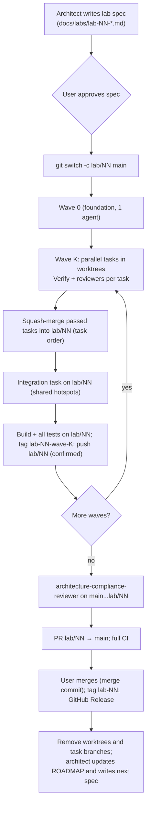

# InPolsure: Delivery

| | |
|---|---|
| **Product** | InPolsure. The repository is still named `AzurePet`. |
| **Status** | **Approved v1** (2026-10-01). Proposed by solution-architect. Patch 2026-10-01 (user-approved): task branches renamed `lab/NN/T-NN.x-slug` → `task/NN/T-NN.x-slug` (§3.1). |
| **Phase** | Incremental implementation (Lab 01) |
| **Owner** | solution-architect |
| **Last updated** | 2026-10-09 |
| **Consistent with** | [ADR-0009](architecture/decisions/0009-iac-and-cicd.md) (IaC, CI/CD, OIDC), [ADR-0012](architecture/decisions/0012-secrets-and-configuration.md) (identities, secrets), [ADR-0014](architecture/decisions/0014-environments-lifecycle.md) (environments lifecycle), [ADR-0016](architecture/decisions/0016-pre-domain-mode.md) (pre-domain mode), [ADR-0010](architecture/decisions/0010-observability.md) (alerts) |

This document describes how code gets from a lab spec to `main` and from
`main` to Azure: branches and protection, the wave workflow with parallel
developer agents, CI/CD and environment promotion, versioning, rollback
and runbooks. Where it describes pipelines that do not exist yet, it
names the lab that introduces them ([`ROADMAP.md`](ROADMAP.md)). If this
document and an ADR disagree, the ADR wins and this document is fixed.

---

## 1. Principles

1. **`main` is protected and always green.** Every commit on `main` has
   passed CI; from Lab 02 on, every commit on `main` is deployed to dev.
2. **One lab, one branch, one PR.** A lab is built on `lab/NN` and
   reaches `main` through one reviewed pull request merged by the user.
3. **Parallel work only where ownership is disjoint.** Tasks of a wave
   own disjoint paths; shared hotspots are edited only by the wave's
   integration task.
4. **Build once, promote the digest** (ADR-0009). The image built from a
   `main` commit is the one that runs in dev, test and prod.
5. **Infrastructure → migration → application → smoke**, always in this
   order (ADR-0009 items 9–10).
6. **Humans own irreversible and privileged actions** (§2.2).

## 2. Roles, responsibilities and guardrails

### 2.1 Who does what

| Actor | Does | Never does |
|---|---|---|
| **User (owner)** | Approves ADRs and lab specs; decides on stuck tasks (§5.4); runs bootstrap Bicep for shared and base layers; manages GitHub settings, environments and RBAC; approves prod; merges lab PRs into `main`; buys the domain (Lab 18) | — |
| **Orchestrating session** (Claude Code main session, acting for the user) | Creates `lab/NN`, worktrees and task branches; starts developer agents and reviewers; squash-merges passed tasks into `lab/NN`; tags waves; pushes `lab/NN` and tags **after the user confirms**; opens the lab PR | Merges into `main`; force-pushes; touches Azure |
| **solution-architect** | Writes `docs/` only: specs, ADRs, ROADMAP, this document | Code, Bicep, pipelines, Azure |
| **dotnet-azure-developer** (one per task) | Implements one task in its own worktree; runs `Verify`; commits **locally** on its task branch | Pushes; edits files outside the task's `Owns`/`Shared files`; creates Azure resources |
| **dotnet-code-reviewer** | Reviews C#/Blazor and tests | Edits files |
| **azure-infra-reviewer** | Reviews Bicep, Docker, workflows, RBAC lists | Edits files |
| **architecture-compliance-reviewer** | Checks phase, lab scope and ADRs (per task where listed, and on the whole lab diff) | Edits files |

### 2.2 Human-only actions (repository guardrails)

The project's `.claude/settings.json` denies these commands to every
agent; some others require the user's confirmation. They are always
performed by the user (or by a pipeline the user triggers):

| Action | Why human-only | Who / how |
|---|---|---|
| Create, update or delete Azure resources (`az deployment …`, `az group …`, `az resource …`, `az containerapp create/update/delete`, `az sql … create/delete`, `az storage account …`) | Cost, data loss, security | Pipelines for workload changes (ADR-0014); the owner for bootstrap of shared and base layers (R8) |
| Change RBAC (`az role assignment …`, `az ad …`) | Privilege escalation | Owner, through reviewed Bicep (bootstrap) |
| Set or delete Key Vault secrets | Secret handling | Owner (R6) |
| `azd up/provision/deploy/down` | Bypasses the pipeline | Not used (ADR-0009: optional local tool only) |
| `docker push` | Only CI pushes images (`cd-dev.yml`, `deploy-dev` identity) | Pipeline |
| `git push --force`, `git reset --hard`, `git clean -fd` | Rewrites shared history, destroys work | Nobody. A leaked secret is revoked and rotated, not removed by force-push (R6) |
| `git push`, `gh pr merge`, any other `az`/`azd` | Leaves the machine or changes shared state | Allowed **with the user's confirmation**; `gh pr merge` into `main` is done by the user |
| Approve prod deployments | NFR-071 | Owner, as required reviewer of GitHub environment `prod` |

---

## 3. Branches and protection

### 3.1 Branch types

| Branch | Created from | Purpose | Merged into | Merge method |
|---|---|---|---|---|
| `main` | — | Always green; deployed to dev (from Lab 02) | — | — |
| `lab/NN` | `main` at lab start | One lab | `main` via PR | **Merge commit** (§3.3) |
| `task/NN/T-NN.x-slug` (integration: `task/NN/T-NN.y-integration`) | current tip of `lab/NN` at wave start | One task, one worktree, one developer agent | `lab/NN` | **Squash** (local) |
| `docs/<slug>` | `main` | Architect changes outside a lab (ADRs, specs, roadmap) | `main` via PR | Squash |
| `fix/<slug>` | `main` | Urgent fix between labs (R3, R7) | `main` via PR | Squash |
| `dependabot/*` | (GitHub) | Dependency updates | `main` via PR | Squash |

Task branches use the `task/` prefix because git cannot hold both a
branch `lab/NN` and branches under `lab/NN/…` (the ref
`refs/heads/lab/NN` is a file, so `refs/heads/lab/NN/…` cannot be
created); the prefix also keeps them out of the `ci.yml` trigger glob
`lab/*`.

Task branches stay local (never pushed). `lab/NN` is pushed after each
wave tag (with confirmation), so CI also runs on it (`ci.yml` triggers
on `lab/*`) and the work is backed up.

**Lab spec changes during a lab** (e.g. an `Owns` correction after a
merge conflict) are committed by the architect on `lab/NN` itself, as
a separate commit `docs: lab NN spec …`, so the spec and the code that
follows it land together.

### 3.2 Protection of `main`

| Rule | Setting |
|---|---|
| Pull request required | Yes; 0 required approvals (single maintainer cannot approve own PRs); conversation resolution required |
| Required status checks (added after Lab 01's PR has run once) | `build-test`, `ui-tests`, `container`, `dependency-review`, `CodeQL`; from Lab 02 also `bicep` (lint/what-if job, ADR-0009 item 4) |
| Branches up to date before merge | Yes |
| Force pushes, deletions | Blocked |
| Linear history | **Not required** (lab PRs use merge commits, §3.3) |
| Bypass | None configured; in an emergency the owner temporarily relaxes a rule and records it in the incident note (R7) |

Repository settings (owner, R0): public visibility; secret scanning with
push protection; Dependabot alerts and security updates; CodeQL default
setup; Actions default token read-only; approval required for workflows
from first-time contributors; merge commit and squash allowed, rebase
merge disabled; delete head branches after merge.

### 3.3 Why lab PRs use a merge commit

Inside a lab every task is squashed into **one commit on `lab/NN`**
(`T-NN.x: title`), and waves are tagged there. Merging the lab PR with a
merge commit keeps those task commits and the `lab-NN-wave-K` tags
reachable from `main`, so `git log --first-parent main` shows one entry
per lab while `git log main` still shows each task (useful for `git
bisect` and review). Squash-merging the lab PR would collapse a whole
lab into one commit and orphan the wave tags; rebase-merging would
rewrite SHAs and also orphan them. Trade-off: `main` history is not
linear; accepted.

---

## 4. Lab lifecycle



Steps in detail:

1. **Spec.** The architect writes `docs/labs/lab-NN-<slug>.md` from the
   merged code of the previous lab (on a `docs/lab-NN-spec` branch, PR
   to `main`). The user approves it (merging the PR is the approval).
2. **Lab branch.** `lab/NN` from the current `main`.
3. **Waves.** As in §5, in the order of the spec's Waves table.
4. **End-of-lab compliance.** `architecture-compliance-reviewer` on the
   full diff `main...lab/NN` against the spec and the ADRs. Blockers
   are fixed through a follow-up task on `lab/NN` (same rules as §5.4).
5. **PR.** `lab/NN` → `main`, title `Lab NN: <name>`, body from the PR
   template (§7) with every acceptance criterion ticked and manual
   checks recorded. Full CI must be green.
6. **Merge.** The user merges with a merge commit. From Lab 02 on, this
   triggers `cd-dev.yml` (§8.3).
7. **Tag and release.** Tag `lab-NN` on the merge commit; GitHub
   Release `lab-NN` with the lab report (FR/NFR closed, ADR deviations,
   deployed digest from Lab 02 on).
8. **Clean-up.** Remove worktrees and local task branches; delete
   `lab/NN` on GitHub after the merge (tags keep the history).
9. **Next spec.** The architect updates [`ROADMAP.md`](ROADMAP.md)
   (status, carried notes) and writes the next spec.

---

## 5. Waves

### 5.1 Spec shape (tasks and waves)

Every lab spec ends with:

```markdown
## Tasks
### T-NN.x <short title>
- Wave: <K or K-int>
- Description: <what to build>
- Depends on: <task ids, or none>
- Owns: <paths/globs this task may create or edit>
- Shared files: <shared files it must touch, or none>
- Acceptance: <testable criteria, referencing AC-xx>
- Verify: <exact commands>
- Review: <reviewer agents>

## Waves
| Wave | Tasks | Parallel? | Why parallel / why not | Reviewers | Tag |
```

Rules:

- **Wave 0** is the foundation (skeleton, shared contracts, project and
  package files) and is executed by **one** developer agent.
- Tasks in one wave have **no dependencies on each other** and **no
  overlapping `Owns`**. Ownership is per wave: a later wave may own
  paths an earlier wave created.
- **Shared hotspots** (`Program.cs`, `*.slnx`, `Directory.*.props`,
  shared `DbContext`/migrations registry, `appsettings*.json`,
  `.github/workflows/*`, `infra/main` entry templates and parameter
  files) belong to **one integration task at the end of the wave**.
- Feature tasks expose their work through extension methods
  (`AddInPolsure…`, `MapInPolsure…`) and test them on a minimal host,
  so they never need a hotspot.
- A task is small enough for one agent session (guideline: ≤ ~400
  changed lines of production code, plus tests).

### 5.2 Starting a wave

For wave K of lab NN, at the current tip of `lab/NN`:

```bash
git switch lab/NN
git pull --ff-only            # only if lab/NN was pushed and changed remotely
git worktree add ../AzurePet.worktrees/T-NN.x -b task/NN/T-NN.x-slug lab/NN
```

- Worktrees live **outside** the repository folder
  (`../AzurePet.worktrees/`), so tools scanning the repo do not pick them
  up.
- One `dotnet-azure-developer` agent per worktree, with its working
  directory set to that worktree.
- Before starting agents, the orchestrator checks the wave table against
  the spec: no `Owns` overlap, all dependencies merged.

### 5.3 Developer agent brief

Each developer agent receives:

1. The lab spec path and its own task ID (the task section is the
   contract).
2. The worktree path and branch name.
3. The rule: edit only `Owns` and declared `Shared files`; if anything
   else must change, **stop and report** (spec gap).
4. The `Verify` commands, which must pass before reporting done.
5. Commit locally on the task branch (one or more commits; they are
   squashed later). No `git push`, no Azure commands, no package
   additions outside the spec's package list.
6. Report: files changed, `Verify` output summary, manual checks done,
   deviations and open questions.

### 5.4 Verify, review and blocker rounds

1. The agent runs `Verify`. Red `Verify` means the task is not ready for
   review.
2. The orchestrator runs the reviewers listed in the task's `Review`
   field on the task branch diff (`lab/NN...task/NN/T-NN.x-slug`).
3. Findings are **Blocker** (must fix), **Major** (fix in this task
   unless the user accepts it) or **Minor/Nit** (optional, may become a
   follow-up).
4. Blockers go back to **the same agent in the same worktree** (round 1).
   After the fix: `Verify` again, then only the reviewers that raised
   Blockers.
5. If Blockers remain after **round 2**, the task is stuck. The user
   decides: **split** it (the architect amends the spec with smaller
   tasks), **move** it and its dependents to a later wave, or **drop**
   it from the lab (with a ROADMAP note). The other tasks of the wave
   continue.
6. A task passes when `Verify` is green and no reviewer reports a
   Blocker.

### 5.5 Merge, integration and wave tag

When all non-deferred tasks of the wave have passed:

```bash
git switch lab/NN
git merge --squash task/NN/T-NN.2-slug && git commit -m "T-NN.2: <title>"
git merge --squash task/NN/T-NN.3-slug && git commit -m "T-NN.3: <title>"
# … in ascending task order
```

- **A merge conflict between tasks of the same wave means the spec's
  `Owns` was wrong.** Stop, abort the merge (`git merge --abort`), let
  the architect fix the spec on `lab/NN`, and redo the affected task's
  merge (usually by rebasing that task branch onto `lab/NN` in its
  worktree and re-running `Verify`).
- Then the **integration task**: a new worktree and branch
  `task/NN/T-NN.y-integration` from the updated `lab/NN`, one developer
  agent, its own `Verify` and reviewers, squash-merged like any task.
- On `lab/NN`, the orchestrator runs the full gate:
  `dotnet build <solution> -c Release`, `dotnet test <solution> -c Release`,
  `dotnet format --verify-no-changes`, plus `az bicep build` for every
  changed template (from Lab 02). Red → the integration agent fixes it
  (same round rules).
- Green → `git tag lab-NN-wave-K`; push `lab/NN` and the tag (with
  confirmation): `git push origin lab/NN lab-NN-wave-K`.
- The next wave branches from the updated `lab/NN`.

### 5.6 End of lab and clean-up

```bash
git worktree remove ../AzurePet.worktrees/T-NN.x   # for each task
git branch -D task/NN/T-NN.x-slug                   # squash-merged, so -D is required
git worktree prune
```

The lab PR, merge, `lab-NN` tag and release follow §4 steps 4–8.

---

## 6. Git command reference (summary)

| Moment | Command |
|---|---|
| Start lab | `git switch main && git pull --ff-only && git switch -c lab/NN` |
| Start task | `git worktree add ../AzurePet.worktrees/T-NN.x -b task/NN/T-NN.x-slug lab/NN` |
| Merge task | `git switch lab/NN && git merge --squash task/NN/T-NN.x-slug && git commit -m "T-NN.x: <title>"` |
| Tag wave | `git tag lab-NN-wave-K && git push origin lab/NN lab-NN-wave-K` (confirmed) |
| Open PR | `gh pr create --base main --head lab/NN --title "Lab NN: <name>" --body-file <report>` |
| After merge (user) | `git switch main && git pull --ff-only && git tag lab-NN && git push origin lab-NN` |
| Clean up | `git worktree remove …`, `git branch -D …`, `git worktree prune` |

## 7. Commits, pull requests and the PR checklist

- Task commits on `lab/NN`: `T-NN.x: <imperative title>`. Fix commits on
  `main`: `fix: …`; documentation: `docs: …`.
- English only; no secrets, tokens or personal data in messages.
- `.github/pull_request_template.md` (created in Lab 01) contains:
  - [ ] Lab/issue reference and spec link
  - [ ] All acceptance criteria ticked; manual checks recorded
  - [ ] Tests added for new behaviour (domain, authorization, isolation)
  - [ ] Cross-tenant suite extended for new data paths (from Lab 04)
  - [ ] CSP and axe pass on new pages
  - [ ] No secrets, no `listKeys()`, no shared keys, no SQL auth
  - [ ] Migrations are expand-only (destructive changes only in a later release)
  - [ ] `teardown` role checked if `workload.bicep` resource types changed (from Lab 09)
  - [ ] ADRs followed; deviations listed with the ADR to supersede
  - [ ] Cost impact noted for Azure changes

---

## 8. CI/CD

### 8.1 Workflows

| Workflow | Trigger | Does | GitHub environment / identity | Introduced in |
|---|---|---|---|---|
| `ci.yml` | PR to `main`; push to `main` and `lab/*`; manual | Build, format, unit/integration/architecture tests (SQL Server container from Lab 03), cross-tenant suite (Lab 04), UI tests (CSP, axe), container build + smoke, vulnerable-package check, dependency review (PR), Bicep lint and what-if (Lab 02, see G-1) | None (no Azure access) until G-1 is decided | 01 (Bicep 02) |
| CodeQL (default setup) | PR, push, weekly | Code scanning | Repository setting | 01 |
| Dependabot | Weekly | Version and security updates as PRs to `main` | — | 01 |
| `cd-dev.yml` | Push to `main` after `ci.yml` succeeds; manual with `digest` input (rollback) | Build image once (tag = git SHA), push to ACR, record digest; deploy `workload.bicep` (dev); start `migrate` job and wait; update app to digest; smoke tests | `dev` / `deploy-dev` | 02 (migrate from 03) |
| `release.yml` | Manual (`digest`, `expiresAt`, `stage`) | Test: create/update workload with `expiresAt` → `migrate` + `seed` → deploy digest → E2E (reads `maildrop`) + fault injection. Prod (after the domain gate): approval → fail fast without platform domain → create/update → `migrate` (+ `bootstrap-superadmin` if new) → wait for certificates → deploy → zero-failure synthetic check → one real email to the owner | `test` / `deploy-test`; `prod` / `deploy-prod` (required reviewer = owner) | 09 (prod stage 19) |
| `teardown.yml` | Every 6 h; manual | Delete workload resources of test/prod whose `expiresAt` passed; write the prod run record first | `teardown` / `id-inpolsure-teardown` (no reviewer, `main` only) | 09 |
| `loadtest.yml` | Manual | Create, run, destroy the load-test environment within a time box | dedicated environment (spec of Lab 20) | 20 |

All workflows follow ADR-0009 item 12: least-privilege `permissions:`
per job, third-party actions pinned by full SHA, no
`pull_request_target` with PR code, no OIDC or secrets for fork PRs,
no secrets stored in GitHub at all.

### 8.2 CI stages (`ci.yml`)

| Stage | Gate | Lab |
|---|---|---|
| Restore, build (warnings as errors), `dotnet format --verify-no-changes` | Fails on any warning or format drift | 01 |
| Unit, integration, architecture tests | Any failure | 01 |
| Integration tests against SQL Server container (RLS exercised); cross-tenant and coverage suites | Any failure (NFR-030, NFR-073) | 03, 04 |
| UI tests (Playwright Chromium): CSP violations, axe WCAG 2.1 AA, key flows | Any violation | 01 |
| Container build and smoke (`/health/live`, `/health/ready`, CSP header) | Non-200 or missing header | 01 |
| Vulnerable packages (`High`/`Critical`) | Any finding (NFR-027) | 01 |
| Dependency review (PR) | `high` severity or worse | 01 |
| CodeQL | High/critical alerts block release | 01 |
| Bicep lint (`az bicep lint` / `bicep build`), what-if for dev | Lint errors; what-if reviewed in PR | 02 |

### 8.3 CD to dev (`cd-dev.yml`, from Lab 02)

Order (ADR-0009 items 6, 9, 10):

1. **Build once:** `docker build`, tag `sha-<git sha>`, push to ACR with
   `deploy-dev` (`AcrPush`); record the **digest** as a workflow output
   and in the run summary.
2. **Infrastructure:** `az deployment group create` with
   `workload.bicep` and `dev.bicepparam` (incremental mode).
3. **Migration** (from Lab 03): `az containerapp job start` for the
   `migrate` job with the new digest; wait for success; on failure stop
   (R4). The app is not updated.
4. **Application:** update the web app to the digest (single-revision
   mode); traffic moves when the readiness probe passes.
5. **Smoke:** `/health/ready`, home page, CSP header; from Lab 05, one
   `maildrop` check (read with `deploy-dev`).

### 8.4 Promotion to test and prod (`release.yml`, from Lab 09)

- Input `digest` must be a digest that passed `cd-dev.yml` smoke tests
  (the workflow looks it up from the dev deployment record; a typed
  digest that never ran in dev is rejected).
- Test stage as in §8.1, `expiresAt` default now + 3 days (max 14).
- Prod stage only after the domain gate (ADR-0016) and the owner's
  approval in GitHub environment `prod`; `expiresAt` default now +
  7 days (max 14). The prod job fails fast if the prod parameter file
  has no platform domain.
- Data: test is re-seeded on creation; prod is created empty and filled
  only through public flows (ADR-0014 §5); the `migrate` job refuses
  `seed` in prod.

### 8.5 Teardown (`teardown.yml`, from Lab 09)

Runs every 6 hours and on demand in GitHub environment `teardown` with
the `id-inpolsure-teardown` identity and its custom role (ADR-0012 §1).
Deletes only **workload** resources in `rg-inpolsure-test` and
`rg-inpolsure-prod` whose `expiresAt` tag has passed, in the order of
ADR-0014 §4 (Container App and job → Container Apps environment → SQL
server → storage account → alert rules). It never touches dev, the
shared layer, the base layer or resource groups. Before deleting prod it
writes the window run record to the base-layer workspace.

### 8.6 Deployment order and expand/contract

| Change type | Release N | Release N+1 or later |
|---|---|---|
| New table, column (nullable or with default), index | Migration in N, used by app N | — |
| Rename column | Add new column + dual-write/backfill in N | Switch reads; drop old in N+1 |
| Drop column/table | Stop using it in N | Drop in N+1 |
| New workload resource type | Bicep in N; `teardown` role updated in the same PR (from Lab 09) | — |

Rule: revision N−1 must work against schema N (rollback safety,
NFR-002, NFR-074). Migrations are never edited after they reached
`main`.

### 8.7 GitHub environments and identities

| GitHub environment | Branches | Protection | Azure identity (OIDC subject `repo:<owner>/<repo>:environment:<env>`) | Rights (ADR-0012 §1) |
|---|---|---|---|---|
| `dev` | `main` | — | `id-inpolsure-deploy-dev` | Contributor + conditional RBAC admin on `rg-inpolsure-dev`, `AcrPush`, `maildrop` read |
| `test` | `main` | — | `id-inpolsure-deploy-test` | Same on `rg-inpolsure-test`, `maildrop` read |
| `prod` | `main` | Required reviewer: owner | `id-inpolsure-deploy-prod` | Same on `rg-inpolsure-prod`, no data-plane rights |
| `teardown` | `main` | None (unattended) | `id-inpolsure-teardown` | Custom read-and-delete role on test/prod workload types |

Environment variables (not secrets) hold subscription ID, tenant ID,
client IDs of the identities, resource group and ACR names.

### 8.8 Smoke and verification tests per stage

| Stage | Checks |
|---|---|
| CI container | `/health/live`, `/health/ready`, CSP header on `/` |
| Dev | `/health/ready`, home page of the demo tenant, CSP header; from Lab 05 an email in `maildrop`; from Lab 07 seeded staff sign-in page reachable |
| Test | E2E (registration with verification link from `maildrop`, ticket flows with seeded pre-verified users), fault injection (Lab 05 mechanism), cross-checks of headers; from Lab 17 zero-failure deploy test |
| Prod | Certificate binding, `/health/ready` on tenant hosts, one real email to the owner, zero-failure synthetic check during deploy, availability test active |

### 8.9 Rollback policy

| What | How | Limits |
|---|---|---|
| Application (dev) | `cd-dev.yml` manual run with the previous `digest` (skips build; runs no migration) | Guaranteed only to N−1 (expand/contract); older digests need a schema check |
| Application (test/prod) | `release.yml` with the previous digest | Same; prod still needs approval |
| Schema | **No down-migrations in pipelines.** Fix forward with a new migration. Test can be recreated; dev can be re-seeded | Data damage in prod: PITR restore to a new database (R4) |
| Infrastructure | Revert the Bicep change by PR; the pipeline redeploys | Deleted stateful resources are restored from backup only in prod (and only while prod exists) |
| Code on `main` | `git revert` of the merge commit (`-m 1`) via a `fix/` PR | Never `reset`/force-push |

---

## 9. Versioning, tags and releases

| Item | Rule |
|---|---|
| Application version | SemVer `0.NN.P` during the MVP: minor = lab number, patch = fixes on `main` between labs. `VersionPrefix` lives in `Directory.Build.props`; each lab's final integration task sets `0.NN.0`; a `fix/` PR bumps `P`. `1.0.0` when all MVP labs (01–16) are done |
| Build metadata | `InformationalVersion` = `0.NN.P+<git sha>` (SDK source-revision metadata); exposed as OTel `service.version` and logged at startup |
| Image | Tag `sha-<40-char git sha>` (immutable by convention, ADR-0009); deployments reference the **digest** |
| Git tags | `lab-NN-wave-K` (on `lab/NN`), `lab-NN` (merge commit on `main`), `v0.NN.P` for fix releases between labs |
| GitHub Releases | One per `lab-NN` (lab report, closed FR/NFR, ADR deviations, digest deployed to dev) and per `v0.NN.P` |
| Deployment record | GitHub environment deployment history (dev/test/prod) plus the run summary with digest, `expiresAt` and smoke results |

---

## 10. Environments and configuration

### 10.1 Environments (ADR-0014, ADR-0016)

| Env | Lifetime | Created / updated by | Deleted by | Hosting mode | Email adapter | Data | Social login | Superadmin sign-in |
|---|---|---|---|---|---|---|---|---|
| local | Developer machine | Developer (`dotnet run`, `docker compose`) | — | `Subdomain` on `*.localhost` | SMTP → Mailpit | `seed` | Yes (local OAuth clients) | Yes (`admin.localhost`) |
| CI | Per run | `ci.yml` | Runner | `Subdomain` (tests send `Host` headers) | Mailpit | Test fixtures | Tests only | Tests only |
| dev | **Permanent**, scales to zero | `cd-dev.yml` on every merge; base layer by owner | — | `SingleTenantDefaultHost` until the domain gate | Blob drop → `maildrop` | Synthetic seed, kept | Off | No (no admin host) |
| test | **On demand**, default 3 days, max 14 | `release.yml`; base layer by owner | `teardown.yml` | Same as dev | Blob drop → `maildrop` | Re-seeded on creation | Off | No |
| prod | **On demand**, default 7 days, max 14; **requires the domain gate** | `release.yml` after approval | `teardown.yml` | `Subdomain` only (startup validation) | SMTP → Brevo | Created empty; public flows only | Yes | Yes (`admin.<domain>`) |
| loadtest | Hours | `loadtest.yml` | `loadtest.yml` | Per Lab 20 spec | Blob drop (no real email) | Synthetic (full or reduced, Q-B3) | Off | Per spec |

### 10.2 Configuration and secrets map

| Setting | local | dev | test | prod | Source |
|---|---|---|---|---|---|
| `ASPNETCORE_ENVIRONMENT` | `Development` | `Production` | `Production` | `Production` | Bicep env var |
| `Deployment:Environment` | `local` | `dev` | `test` | `prod` | Bicep env var (ADR-0016) |
| `Hosting:Mode` | `Subdomain` | `SingleTenantDefaultHost` | `SingleTenantDefaultHost` | `Subdomain` | `appsettings.{Env}` / Bicep |
| `Hosting:DefaultHostTenantSlug` | — | demo slug | demo slug | — (refused) | Bicep param |
| `Hosting:PlatformDomain` | `localhost` | — until gate | — until gate | required | Bicep param |
| SQL connection | Local container, SQL login in user-secrets or compose env (local only) | Entra (managed identity `app`), no password | same | same | Bicep env var (server/database names, client ID) |
| Storage | Azurite | Account endpoint + `app` identity | same | same | Bicep env var |
| Key Vault URI | — | base-layer vault | same | same | Bicep env var |
| Data Protection key | Local file system | Blob + Key Vault key (Lab 07) | same | same | Bicep env var |
| Email | Mailpit host/port | `BlobDrop` | `BlobDrop` | Brevo host/port; **SMTP key from Key Vault** | `appsettings` + Key Vault reference |
| OAuth (Google, Microsoft) | **`dotnet user-secrets`** | off | off | **Key Vault** (after gate) | — |
| Telemetry | `OTEL_EXPORTER_OTLP_ENDPOINT` (Aspire dashboard) | App Insights connection string (configuration, not a secret) | same | same | Bicep env var |
| `Security:Csp:ReportOnly` | `false` | `false` | `false` | `false` | `appsettings.json` |
| `Diagnostics:EnableUiProbePages` | `true` (Development) | `false` | `false` | `false` | `appsettings.{Env}` |
| Fault injection for email (Lab 05) | allowed | allowed | allowed (E2E) | **refused at startup** | Per Lab 05 spec |

There are **no secrets in GitHub** (OIDC), **none in images**, **none in
the repository**. The only secrets that exist are third-party
credentials in prod's Key Vault after the domain gate, and local OAuth
test credentials in each developer's user-secrets (ADR-0012 §2).

---

## 11. Runbooks

Each runbook states who acts. "Owner" means the user; commands that
change Azure are run by the owner or by a workflow the owner triggers.

### R0. First-time repository setup (before Lab 01)

1. Owner commits the design docs and agent configuration on `main`
   (the only direct commit to `main`).
2. Owner creates the **public** GitHub repository and pushes `main`.
3. Owner applies the settings of §3.2 (secret scanning with push
   protection, Dependabot, token read-only, contributor approval, merge
   methods) and protects `main` (PR required, no force push, no
   deletion).
4. After Lab 01's PR has run CI once: add the required status checks of
   §3.2 and enable CodeQL default setup.

### R1. Deploy to dev (normal path, from Lab 02)

1. User merges a PR into `main`.
2. `ci.yml` runs on `main`; on success `cd-dev.yml` runs (§8.3).
3. Check the run summary: digest, migration job result, smoke results.
4. **Failed deploy:** if it failed in the Bicep step, the old revision
   keeps serving; fix by PR. If the migration failed, see R4. If the new
   revision fails readiness, Container Apps keeps the old revision
   serving in single-revision mode; inspect revision logs in Log
   Analytics (`ContainerAppConsoleLogs_CL` / system logs), fix forward
   by PR or roll back (R3).

### R2. Create, extend or end a test (or prod) window (from Lab 09)

- **Create:** run `release.yml` with `stage=test`, `digest=<dev-tested
  digest>`, optional `expiresAt`. Target ≤ 30 min (NFR-072). Record the
  time on the first runs.
- **Extend:** re-run `release.yml` with a later `expiresAt` (≤ 14 days
  from now). Workload is updated in place.
- **End:** run `teardown.yml` manually with `force=<env>` (deletes the
  workload even if not expired; the input is accepted only for test and
  prod).
- **Prod:** only after the domain gate; the owner approves the `prod`
  job; after the window check the Cost Management view (ADR-0014).

### R3. Roll back an application release

1. Identify the last good digest (GitHub environment deployment history
   or the previous `cd-dev.yml` run summary).
2. Dev: run `cd-dev.yml` manually with `digest=<previous>` (no build, no
   migration). Test/prod: run `release.yml` with that digest.
3. Verify smoke results. Expand/contract guarantees N−1 runs on schema N.
4. Fix forward on `main` through a `fix/` PR (bump `P`, §9); revert the
   offending merge with `git revert -m 1 <merge>` if the fix is not
   quick.

### R4. Failed migration

1. `cd-dev.yml`/`release.yml` stops before updating the app; the old
   revision keeps serving.
2. Read the `migrate` job execution logs (Log Analytics, job execution
   history).
3. If the migration is partially applied (each EF Core migration runs
   in its own transaction by default; a failure leaves earlier
   migrations applied): fix forward with a corrective migration on a
   `fix/` PR. **Never edit a migration that reached `main`.**
4. Dev: if the database is unusable, the owner may drop and recreate it
   by redeploying after deleting the database (owner action; dev data is
   synthetic and re-seeded). Test: recreate via R2.
5. Prod: if data is damaged, point-in-time restore to a **new**
   database (owner, during the window), point the app to it through a
   parameter change, and record the incident (R7).

### R5. Teardown problems (from Lab 09)

- **Teardown failed midway:** re-run `teardown.yml` (idempotent; it
  deletes what remains in ADR-0014 order).
- **Teardown refused a resource (403):** a workload resource type is
  missing from the custom role. Do not grant broader roles; add the type
  to the role definition in the shared Bicep by PR (azure-infra-reviewer
  checks it against `workload.bicep`), owner applies it (R8), re-run.
- **Forgotten environment noticed via budget alert:** run `teardown.yml`
  with `force=<env>`; then check why `expiresAt` was missing or too far
  in the future.

### R6. Secret rotation

Inventory (ADR-0012): no Azure-service secrets exist (managed
identities, OIDC). Rotatable items:

| Item | Where | Rotation |
|---|---|---|
| Data Protection key-wrapping key | Key Vault (each env) | Owner creates a new key version; the app wraps new keys with it and can still unwrap old ones (keep old versions enabled); Data Protection rotates its own keys every 90 days by default |
| Brevo SMTP key (prod, after gate) | Key Vault `prod` | Owner creates a new key in Brevo → new secret version in Key Vault → restart the revision (`az containerapp revision restart`, owner) → send a test email → revoke the old key in Brevo |
| Google client secret / Microsoft app credential (after gate) | Key Vault per env | Same pattern; for Microsoft prefer a certificate or federated credential (no secret) |
| Local OAuth test credentials | Developer `dotnet user-secrets` | Regenerate at the provider, `dotnet user-secrets set …` |

**Leaked secret** (e.g. pushed despite push protection): treat it as
compromised immediately: revoke at the provider, rotate, check the
provider's and Azure's logs for use. Do **not** rewrite git history with
a force push (the repository is public; the secret is already exposed).
Record it as an incident (R7).

### R7. Incident basics

1. **Detect:** alert email from the action group (ADR-0010), budget
   alert, failed workflow, or user report.
2. **Classify:** S1 = suspected cross-tenant data access or credential
   leak; S2 = core flow down in an environment with targets (prod while
   it exists); S3 = everything else (dev/test have no targets).
3. **Contain:** S1 → stop traffic to the affected environment (owner:
   scale the app to 0 replicas or disable ingress) and preserve logs;
   credential leak → R6. S2 → roll back (R3). Cost spike → teardown (R2/R5).
4. **Investigate:** Application Insights failures and traces by
   `TraceId`; Log Analytics by `tenant.id`; audit events in SQL for "who
   accessed what" (NFR-044: queryable within 1 h; breach assessment
   within 72 h).
5. **Fix forward** through a `fix/` PR; never patch Azure resources by
   hand (NFR-070).
6. **Record:** a short note in `docs/operations/incidents/YYYY-MM-DD-<slug>.md`
   (written by the architect from the owner's facts): timeline, impact,
   cause, fix, follow-ups; ADR change if a decision was wrong.

### R8. Bootstrap or change the shared and base layers (owner)

1. A PR changes `infra/shared*.bicep` or `infra/base.bicep` (reviewed
   by azure-infra-reviewer) and is merged.
2. Owner runs `az deployment … what-if`, reviews it, then the
   deployment, from the merged `main` (commands documented in the lab
   spec that introduced the template).
3. Owner configures the matching GitHub environment (variables only; no
   secrets).
4. Target for a new environment: ≤ 1 h end to end (NFR-072).

### R9. Domain gate (Lab 18, user-triggered)

Follow ADR-0016 §4 and the Lab 18 spec. Until then, no prod exists and
`release.yml`'s prod stage fails fast by design.

---

## 12. Consistency with ADRs and open points

| Topic | Source | Where in this document |
|---|---|---|
| Workflows, build once, OIDC per environment, migrations as a job, expand/contract, public-repo hardening | ADR-0009 | §8 |
| Identities and roles, no secrets in GitHub, `maildrop` grants, `teardown` custom role | ADR-0012 | §8.7, §10.2, R5, R6 |
| Permanent dev, on-demand test and prod, `expiresAt`, 6-hourly teardown, base/workload layers | ADR-0014 | §8.4, §8.5, §10.1, R2, R5, R8 |
| Pre-domain mode, prod blocked before the gate | ADR-0016 | §8.4, §10.1, §10.2, R9 |
| Alerts and run records | ADR-0010 | §8.5, R7 |

**Gaps found while writing this document (no ADR was changed):**

| # | Gap | Proposal | Needs |
|---|---|---|---|
| G-1 | ADR-0009 item 4 asks for `what-if` on pull requests, but no identity is defined for PR jobs: fork PRs get no OIDC token, and the dev federated credential is bound to GitHub environment `dev` (a PR job targeting `dev` would receive a Contributor-level token for PR code). | Lab 02 spec: Bicep lint/build on every PR (no Azure access); `what-if` against dev only for PRs from branches of this repository, in a job that targets environment `dev` and runs only after the owner approves the run, **or** `what-if` inside `cd-dev.yml` before deployment with the PR showing lint only. | **Decided 2026-10-01:** `what-if` inside `cd-dev.yml` before deployment; PRs run lint/build only. A short ADR amending ADR-0009 item 4 is written before the Lab 02 spec. |
| G-2 | The .NET 10 Blazor Web App renders an inline import-map `<script>` (`ImportMap` component). ADR-0011's CSP is `script-src 'self'`. | Lab 01 removes the import map if not needed; otherwise a per-request SHA-256 hash for it (Lab 01 spec §6.1). | **Closed 2026-10-09:** the import map was removed in T-01.9; no hash was needed and ADR-0011's CSP string is unchanged. |
| G-3 | ADR-0012's teardown action list may not cover extension and child resources (diagnostic settings on the Container Apps environment, managed certificates after the gate, role assignments scoped to workload resources). | Lab 09 derives the list from the real `workload.bicep` and test-runs teardown. Adding resource types is foreseen by ADR-0012; anything needing `Microsoft.Authorization/*` would contradict it. | Superseding ADR only if `Microsoft.Authorization/*` is required |
| G-4 | Merge method for lab PRs is not covered by an ADR. | Merge commit (§3.3). | **Confirmed 2026-10-01** |
| G-5 | Dependabot PRs go straight to `main`, outside the lab flow. | Allowed when CI is green; the user merges them (squash) between waves or labs, not during a lab's final PR review. | **Confirmed 2026-10-01** |
