# InPolsure: Lab Roadmap

| | |
|---|---|
| **Product** | InPolsure. The repository is still named `AzurePet`. |
| **Status** | **Approved v1** (2026-10-01). Proposed by solution-architect. |
| **Phase** | 5: Lab roadmap |
| **Owner** | solution-architect |
| **Last updated** | 2026-10-01 |
| **Inputs** | [`PLAN.md`](PLAN.md) v3.1, [`REQUIREMENTS.md`](REQUIREMENTS.md) v2.2, [`ARCHITECTURE.md`](ARCHITECTURE.md) v2.1, ADR-0001 to ADR-0017 (all Accepted) |
| **Related** | [`DELIVERY.md`](DELIVERY.md) (how a lab gets from spec to `main`), [`labs/`](labs/) (lab specs) |

This document lists every lab in order. For each lab it gives the goal,
the requirements and ADRs it realises, the main deliverables, its
dependencies and its exit criteria. It is a plan, not a spec: the
detailed spec of a lab (tasks, waves, acceptance criteria) is written
**one lab at a time, just before the lab starts**, from the real code
of the previous lab. Only [Lab 01](labs/lab-01-walking-skeleton.md) has
a spec now.

---

## 1. Rules for all labs

1. **Small and complete.** Each lab adds one meaningful capability and
   ends with `main` green: built, tested, reviewed and (from Lab 02 on)
   deployed to dev by the pipeline (PLAN principle 11, NFR-071).
2. **Requirements first.** A lab only builds what its listed FRs/NFRs
   need. Anything else goes to a later lab or needs a requirements
   change.
3. **ADRs are binding.** If a lab finds that an ADR is wrong or
   incomplete, the lab stops on that point and the solution-architect
   writes a superseding ADR (PLAN §7). Code never changes a decision
   silently.
4. **Local first.** Every lab builds and runs locally without an Azure
   subscription (NFR-075); Azure is for deployment, not for development.
5. **Tests in every lab.** Domain rules, authorization and tenant
   isolation tests grow with each lab (NFR-073). From Lab 04 on, every
   new tenant-scoped table, endpoint, query, file link or job joins the
   cross-tenant suite (ADR-0002 §7).
6. **Human steps stay human.** Agents never create or delete Azure
   resources, change RBAC, run `azd up`, `docker push` or
   `git push --force`. Each lab lists the owner's steps (bootstrap
   Bicep, GitHub settings, approvals) explicitly ([`DELIVERY.md`](DELIVERY.md) §2).
7. **Cost check.** A lab that adds or changes Azure resources ends with
   a check of the Cost Management view against ARCHITECTURE §9.7
   (NFR-060, R-11).
8. **Spec shape.** Each spec has Goal, Scope / Out of scope, ADRs and
   requirements, acceptance criteria, hints, Tasks (owned paths,
   dependencies, `Verify`, `Review`) and Waves, as defined in
   [`DELIVERY.md`](DELIVERY.md) §5.

## 2. Lab overview

| # | Lab | Goal (one line) | Depends on | Azure? |
|---|---|---|---|---|
| 01 | [Walking skeleton](#lab-01-walking-skeleton) | Solution, Blazor host, health, CSP, telemetry, container image and CI: a deployable artefact | — | No |
| 02 | [First deployment to dev](#lab-02-first-deployment-to-dev) | Bicep (shared, base, workload) and `cd-dev.yml`: every merge to `main` runs in Azure dev | 01 | Yes (dev) |
| 03 | [Data foundation](#lab-03-data-foundation) | EF Core, Azure SQL, the `migrate` job, tenant catalog and `seed` | 02 | Yes (dev) |
| 04 | [Tenant isolation](#lab-04-tenant-isolation) | Tenant resolution, scopes, EF filters and RLS, pre-domain mode, cross-tenant suite | 03 | Yes (dev) |
| 05 | [Outbox and email](#lab-05-outbox-and-email) | Transactional outbox, dispatcher, `IEmailSender` (Mailpit, blob drop), fault simulation | 04 | Yes (dev) |
| 06 | [Audit and maintenance](#lab-06-audit-and-maintenance) | Append-only audit store, purge procedure, maintenance host | 05 | Yes (dev) |
| 07 | [Identity I: staff and superadmins](#lab-07-identity-i-staff-and-superadmins) | Identity store, cookies, MFA, passkeys, invitations, session revalidation, superadmin bootstrap | 06 | Yes (dev) |
| 08 | [Identity II: clients](#lab-08-identity-ii-clients) | Self-registration, email verification, consent, password reset, social login (local), HTTP rate limits | 07 | Yes (dev) |
| 09 | [Release to test and teardown](#lab-09-release-to-test-and-teardown) | On-demand test via `release.yml`, E2E with `maildrop`, fault injection, `teardown.yml` | 08 | Yes (dev, test) |
| 10 | [Client tickets](#lab-10-client-tickets) | Client portal: create ticket and FNOL, list, detail, reply, close; ticket emails to clients | 09 | Yes |
| 11 | [Agent workspace](#lab-11-agent-workspace) | Queue, search, assignment, status, internal notes, concurrency, timeline, claim number | 10 | Yes |
| 12 | [Attachments](#lab-12-attachments) | Validated upload, authorised SAS download, internal-only files, audit | 11 | Yes |
| 13 | [White-label branding](#lab-13-white-label-branding) | Branding settings, contrast check, `/theme.css`, logo, branded emails | 12 | Yes |
| 14 | [Admin panels and tenant onboarding](#lab-14-admin-panels-and-tenant-onboarding) | Tenant admin panel, dashboard, superadmin panel, tenant lifecycle, invitation on `TenantHostnameReady` | 13 | Yes |
| 15 | [Privacy and GDPR](#lab-15-privacy-and-gdpr) | Data export and erasure, profile correction, retention purge job | 14 | Yes |
| 16 | [Observability and alerts](#lab-16-observability-and-alerts) | Alerts, workbooks, log-content test, cost proxies | 15 | Yes |
| 17 | [Resilience rehearsal in test](#lab-17-resilience-rehearsal-in-test) | Zero-downtime deploy check, circuit reconnect, cold starts, environment timing, all in test | 16 | Yes (test) |
| 18 | [Domain gate](#lab-18-domain-gate-user-triggered) *(user-triggered)* | Buy a domain; subdomain mode, social login and real email in Azure | 17 | Yes |
| 19 | [Prod window](#lab-19-prod-window-requires-lab-18) *(requires 18)* | First prod: SLO measurement, zero-downtime in prod, real email, restore drill | 18 | Yes (prod) |
| 20 | [Load test](#lab-20-load-test) | Design-load test (full or reduced dataset), noisy-neighbour burst, tuning | 17 (19 optional) | Yes (loadtest) |
| 21 | [Hardening](#lab-21-hardening) | ASVS L2 review, header scan, rotation runbooks, restore drill, cost review | 20 | Yes |

**Milestones**

| Milestone | Labs | Result |
|---|---|---|
| M1 Platform skeleton | 01–04 | Multi-tenant, deployable host with data, isolation and pipeline |
| M2 Identity and messaging | 05–09 | All four audiences can sign in; emails flow; on-demand test and teardown work |
| M3 Product MVP | 10–15 | All MVP functional requirements |
| M4 Operations | 16–17 | Alerts, dashboards and resilience proven in test |
| M5 Gated | 18–19 | Domain, prod and formal SLO evidence; only when the user decides (Q-B1) |
| M6 Scale and hardening | 20–21 | Design targets proven by measurement; security and cost review |

```mermaid
flowchart LR
    L01[01 Skeleton] --> L02[02 Dev deploy] --> L03[03 Data] --> L04[04 Isolation]
    L04 --> L05[05 Outbox/email] --> L06[06 Audit] --> L07[07 Identity I] --> L08[08 Identity II] --> L09[09 Test + teardown]
    L09 --> L10[10 Client tickets] --> L11[11 Agent workspace] --> L12[12 Attachments] --> L13[13 Branding] --> L14[14 Admin panels] --> L15[15 GDPR]
    L15 --> L16[16 Observability] --> L17[17 Resilience in test]
    L17 --> L18[18 Domain gate*] --> L19[19 Prod window*]
    L17 --> L20[20 Load test] --> L21[21 Hardening]
    L19 -.-> L20
```

\* User-triggered (ADR-0016 §4, Q-B1). Labs 20 and 21 do not need
them: their prod-dependent parts are rehearsed in test, and the formal
prod evidence is produced in Lab 19 when the gate is passed.

**Why this order differs from the tentative list in PLAN §7.** The
plan's themes are all kept, but: (1) the outbox and email (PLAN theme
10) move before identity, because verification, invitation and reset
emails need them (FR-020, FR-023, FR-027); (2) audit moves before
identity, because sign-ins are audited (FR-100); (3) the on-demand test
environment (PLAN theme 15) is introduced right after identity, so that
every later lab is released through test with real E2E flows; (4) PLAN
themes 2 and 3 (CI, IaC) are split as "local + CI" (Lab 01) and "Azure
deploy" (Lab 02) so that Lab 01 needs no Azure resources and no owner
bootstrap; (5) the domain gate and prod are separate, user-triggered
labs (ADR-0016, Q-B1).

---

## 3. Labs

### Lab 01: Walking skeleton

- **Goal:** a buildable, tested, scanned and **deployable artefact**: a
  .NET 10 solution with the Blazor host (Static SSR by default, one
  interactive probe page), health endpoints, security headers and a
  strict CSP, OpenTelemetry to a local Aspire dashboard, the shared UI
  component library baseline, a non-root container image and the
  `ci.yml` pipeline with the public-repository security gates. The
  image is "deployable" in the sense that it is the exact artefact
  Lab 02 pushes and runs in Azure; Lab 01 itself creates no Azure
  resources.
- **Realises:** NFR-051, NFR-075, NFR-026 (baseline), NFR-050 (local
  baseline), NFR-071 (CI part), NFR-073 (test infrastructure), NFR-027,
  NFR-023 (scanning and push protection), NFR-080/NFR-081 (baseline),
  NFR-082; C-01, C-04. ADR-0001, 0004 (image, probe paths), 0008
  (default render mode), 0009 (`ci.yml`, item 12), 0010 (health, OTel,
  local dashboard), 0012 (§6, §7), 0017 (component baseline and the
  CSP check of item 5).
- **Key deliverables:** solution and conventions; `InPolsure.Web`,
  `InPolsure.SharedKernel`, `InPolsure.Ui`; unit, integration,
  architecture and Playwright/axe UI test projects; `Dockerfile` and
  `compose.yaml`; `.github/workflows/ci.yml` and `dependabot.yml`;
  `README.md`.
- **Depends on:** nothing (owner creates the public GitHub repository
  and enables its security settings, [`DELIVERY.md`](DELIVERY.md) §11 R0).
- **Exit criteria:** see the spec's Definition of Done. In short: CI
  green on the lab PR (build, tests, UI tests, container smoke,
  dependency review); CSP enforced with zero violations and zero axe
  violations; image runs as non-root and answers `/health/live`;
  required status checks configured on `main`; tag `lab-01`.
- **Spec:** [`labs/lab-01-walking-skeleton.md`](labs/lab-01-walking-skeleton.md).

### Lab 02: First deployment to dev

- **Goal:** every merge to `main` builds the image once, pushes it to
  ACR and deploys it to the permanent dev environment in Poland Central;
  budgets exist from this first deployment.
- **Realises:** NFR-061, NFR-062, NFR-070, NFR-071 (CD to dev), NFR-072
  (dev part), NFR-021, NFR-040, NFR-050 (Azure export); C-02, C-03, C-05.
  ADR-0004, 0009 (items 1–4, 6 `cd-dev.yml`, 7, 8, 12), 0010 (Azure
  Monitor exporter, base-layer workspace), 0012 (identity inventory for
  dev, no `listKeys()`, Container Apps logs via `azure-monitor`
  destination), 0014 (layers), 0015, 0016 (default FQDN).
- **Key deliverables:** `infra/` layout (defined in the Lab 02 spec, as
  ADR-0009 item 1 requires); `shared` Bicep (ACR Basic, `deploy-dev`
  identity with federated credential, budget 50/80/100%, region policy);
  `base.bicep` (`app` and `migrator` identities, Key Vault, Log
  Analytics + Application Insights, action group, AcrPull);
  `workload.bicep` for dev (Container Apps environment with the
  `azure-monitor` log destination and a diagnostic setting, web app with
  probes and sticky sessions; **no SQL or storage yet**); `dev`
  parameter file; `cd-dev.yml`; Bicep lint (and what-if, see open
  point G-1 in [`DELIVERY.md`](DELIVERY.md) §12) in CI; Azure Monitor OpenTelemetry exporter enabled by
  configuration; forwarded headers for the ingress.
- **Depends on:** 01.
- **Human steps:** region checks from ADR-0004 (`az provider show -n
  Microsoft.App`, workload profiles in `polandcentral`); owner runs the
  shared and dev base Bicep (bootstrap, R8 in DELIVERY); GitHub
  environment `dev`; ACR name decision.
- **Exit criteria:** a merge to `main` deploys dev without manual steps;
  the default FQDN serves the home page and `/health/ready`; requests
  appear in Application Insights within minutes; the budget and its
  alerts exist; idle dev scales to zero; secret scan finds nothing; the
  cost view shows dev ≈ 0 USD.
- **Notes:** the fallback order of ADR-0004 applies if Container Apps
  or workload profiles are not available.

### Lab 03: Data foundation

- **Goal:** the application has a relational store with versioned
  migrations, applied inside Azure by the `migrate` Container Apps Job
  before each new revision.
- **Realises:** NFR-074, NFR-004/NFR-006 (configuration for later prod),
  NFR-022, NFR-024 (`app` vs `migrator`), FR-024 (command skeleton),
  NFR-083. ADR-0001 (module projects, one `DbContext` and schema per
  module, command roles), 0002 §6 (`DataLocation`), 0005, 0009 item 9,
  0012 (grants script, `migrator` as Entra admin), 0015 (Entra-only SQL).
- **Key deliverables:** Tenancy module project with `tenancy.Tenants`
  (catalog incl. the reserved Platform row and `DataLocation`) as a
  platform-scoped table; one-shot command dispatch in the host
  (`migrate`, `seed`; `bootstrap-superadmin` reserved for Lab 07);
  idempotent grants script; SQL Server container in `compose.yaml` and
  in CI (Testcontainers); `workload.bicep` adds the SQL logical server
  and database (free offer, auto-pause 15 min) and the `migrate` job;
  `cd-dev.yml` runs `migrate` before the revision update; readiness
  probe without a database check in dev/test (ADR-0010 item 6).
- **Depends on:** 02.
- **Human steps:** confirm the SQL free offer is available in Poland
  Central for the subscription (ADR-0005 fallback otherwise).
- **Exit criteria:** `migrate` and `seed` run locally, in CI and in dev;
  the app identity cannot run DDL (test); SQL authentication is
  disabled; GitHub runners never connect to SQL; dev database
  auto-pauses when idle; free-amount metric visible.

### Lab 04: Tenant isolation

- **Goal:** every request and job runs in exactly one scope, tenant data
  is isolated in two layers, and the cross-tenant suite proves it.
- **Realises:** FR-002 (neutral notice for *Suspended*), FR-004,
  FR-022 (basis), NFR-030, NFR-031, NFR-032, NFR-033 (design), NFR-073.
  ADR-0002, 0011 items 1–5, 0016 (both hosting modes and the startup
  validation), 0010 (`tenant.id` on telemetry).
- **Key deliverables:** host allow-list and tenant-resolution
  middleware; `Hosting:Mode` (`Subdomain` locally and in CI,
  `SingleTenantDefaultHost` in dev with `DefaultHostTenantSlug`) with
  `ValidateOnStart` rules; `TenantContext`, `ITenantScopeFactory` with
  the allow-list; connection interceptor setting `SESSION_CONTEXT`
  read-only and refusing scope-less connections; RLS security policy and
  predicate; EF global filters and the `SaveChanges` stamping
  interceptor; first tenant-scoped table (`tenancy.TenantSettings`);
  coverage check, Platform-scope tests, exemption tests, scope-switch
  test; architecture test banning `IgnoreQueryFilters()` (library or
  analyzer choice made in the spec); unknown-tenant and suspended
  pages; seed with three demo tenants (one mapped to the dev FQDN).
- **Depends on:** 03.
- **Exit criteria:** cross-tenant suite green in CI against a real SQL
  Server container; a request without a scope cannot open a connection;
  `acme.localhost` and `globex.localhost` resolve to different tenants
  locally; dev serves the demo tenant only; startup fails for
  `SingleTenantDefaultHost` with `Deployment:Environment=prod`.

### Lab 05: Outbox and email

- **Goal:** cross-module side effects travel through a transactional
  outbox and a restartable in-process dispatcher; emails are rendered
  and "sent" through `IEmailSender` without a provider or a domain.
- **Realises:** FR-074 (rule), FR-075, NFR-003, NFR-017 (mechanism),
  NFR-050 (trace continuation), NFR-062. ADR-0007 items 1–4, 6, 7;
  ADR-0001 item 5 (`Roles` = `Web`/`Worker`); ADR-0006 (`maildrop`
  container); ADR-0012 (`maildrop` read grant for `deploy-dev` and the
  owner); ADR-0004 (60 s grace period).
- **Key deliverables:** shared-kernel outbox writer and
  `platform.OutboxMessages`; dispatcher (wake-up, 30 s poll, leases,
  backoff, tenant scope per message, graceful shutdown); Notifications
  module with `NotificationDeliveries` dedupe; `SmtpEmailSender` to
  Mailpit (local, CI) and `BlobDropEmailSender` (Azure dev/test);
  Mailpit in `compose.yaml`; `workload.bicep` adds the storage account
  with the `maildrop` container (7-day lifecycle) and the scoped reader
  assignment; outbox metrics (pending age, failed count).
- **Depends on:** 04.
- **Review note (carried):** **the way to simulate an email failure is
  chosen in this lab's spec**, so that the fault-injection test of
  NFR-003 can run locally/CI now and in test in Lab 09. Candidates to
  evaluate there: a configuration-driven failing decorator around
  `IEmailSender` (allowed only when `Deployment:Environment` is not
  `prod`, enforced by `ValidateOnStart`), versus stopping Mailpit in
  CI, versus a network-level fault proxy. Whatever is chosen must not
  add an unauthenticated runtime switch to the app.
- **Exit criteria:** a test-only integration event produces exactly one
  delivery per recipient; with the email adapter failing, the action
  succeeds and the email arrives after recovery (0 lost events);
  `.eml` files appear in `maildrop` in dev and can be read with the
  `deploy-dev` identity; dispatcher stops claiming on `SIGTERM`.

### Lab 06: Audit and maintenance

- **Goal:** security-relevant events are recorded append-only and
  purged only after 2 years, and a maintenance host runs daily work
  safely under scale-to-zero.
- **Realises:** FR-100 (store and write API), FR-101, FR-102, NFR-044,
  NFR-024. ADR-0005 (audit table, `DENY UPDATE, DELETE`,
  `audit.usp_PurgeExpired`), ADR-0007 item 5, ARCHITECTURE §9.9
  (maintenance with `sp_getapplock` and catch-up on start), ADR-0002
  (purge per tenant scope; maintenance on the scope-factory allow-list).
- **Key deliverables:** Audit module and contract; tenant-scoped
  `audit.AuditEvents` with RLS; grants for the `app` identity; purge
  procedure with batching; maintenance hosted service (outbox cleanup,
  audit purge) with single-runner lock and catch-up.
- **Depends on:** 05.
- **Exit criteria:** tests prove the `app` identity cannot update or
  delete audit rows but can execute the purge; purge removes only rows
  older than 2 years per tenant; maintenance runs once across two
  replicas and catches up after a pause.

### Lab 07: Identity I: staff and superadmins

- **Goal:** tenant admins, agents and superadmins can sign in securely
  with mandatory MFA; sessions end on deactivation, suspension and
  idle timeout, also inside Interactive Server circuits.
- **Realises:** FR-002 (sign-in refused), FR-022, FR-023, FR-024,
  FR-025, FR-028 (roles and policies), FR-031 (staff), FR-100
  (sign-in events), NFR-025 (lockout), NFR-024. ADR-0003 items 1–4, 6,
  7, 9; ADR-0008 rules 4–5; ADR-0012 §4 (Data Protection key ring in
  Blob, wrapped with the Key Vault key); ADR-0002 (superadmins under
  `PlatformTenantId`); ADR-0010 item 8 (superadmin sign-in signal).
- **Key deliverables:** tenant-scoped Identity store and custom user
  store; host-only cookies with the `tenant_id` claim check; roles and
  policies; TOTP and passkeys for staff, passkey-only superadmins on
  `admin.localhost`; `bootstrap-superadmin` command; staff invitation
  flow through the outbox (minimal page; full panel in Lab 14);
  revalidating authentication state provider, circuit idle timeout and
  session refresh endpoint; Data Protection persisted to Blob and
  wrapped by Key Vault (`dataprotection` container); audit of sign-ins.
- **Depends on:** 06.
- **Exit criteria:** staff without MFA cannot reach staff areas; a
  deactivated agent's open circuit loses access within about a minute;
  superadmin sign-in works only on the admin host with a passkey and
  emits audit event, security email and metric; dev still serves the
  demo tenant (staff from `seed`); key ring survives a revision restart
  in dev.
- **Note:** superadmin sign-in in Azure waits for the domain gate
  (ADR-0016); it is proven locally and in CI.

### Lab 08: Identity II: clients

- **Goal:** anyone can register on a tenant's portal, verify their
  email, accept the tenant's notices and sign in with a password or
  (locally) Google or Microsoft; public endpoints are rate limited.
- **Realises:** FR-020, FR-021, FR-022, FR-027, FR-031 (clients),
  FR-032, FR-070, FR-110, FR-111 (profile basics), NFR-015, NFR-025,
  NFR-028 (verified email rule). ADR-0003 items 5, 8; ADR-0013 HTTP
  policies (`auth-strict`, `anonymous`, `user`, `tenant`); ADR-0016
  (social login local only, switched off in Azure dev/test); Privacy
  module (consent records).
- **Key deliverables:** Static SSR registration, verification, sign-in,
  reset and email-change pages; relationship field and consent records;
  central auth host on `localhost` with data-protected login-request
  token and the `identity.ExternalLoginHandoffs` platform table;
  rate-limiting policies with 429 page and metrics; tests for handoff
  single use, expiry and tenant binding.
- **Depends on:** 07.
- **Human steps:** create local Google and Microsoft OAuth test clients
  (localhost redirect URIs; credentials in `dotnet user-secrets` only).
- **Exit criteria:** same email registers independently on two tenants;
  verification link from Mailpit (local) and `maildrop` (dev) works;
  unverified clients are flagged for the ticket rule of Lab 10; handoff
  for tenant A cannot be redeemed on tenant B; social buttons hidden and
  endpoints 404 in dev.

### Lab 09: Release to test and teardown

- **Goal:** the owner can create an on-demand test environment from the
  pipeline, verify the release there with E2E and fault-injection tests,
  and forgotten environments are deleted automatically.
- **Realises:** C-07, NFR-003 (fault injection in Azure), NFR-062,
  NFR-063 (teardown mechanics), NFR-071, NFR-072 (test ≤ 30 min),
  FR-020 (E2E). ADR-0009 item 6 (`release.yml` test stage, `teardown.yml`),
  items 7–8 (`deploy-test`, `teardown` identity and environments);
  ADR-0012 §1 (`teardown` custom role, `maildrop` read for
  `deploy-test`); ADR-0014 §3–§6.
- **Key deliverables:** test parameter file; `release.yml` (test stage
  only: create/update workload with `expiresAt`, `migrate` + `seed`,
  deploy the dev-tested digest, E2E reading `maildrop`, fault-injection
  test using the mechanism chosen in Lab 05); `teardown.yml` (manual and
  every 6 h, `expiresAt` check in the workflow); custom role definition
  `InPolsure Workload Teardown` in the shared Bicep; Playwright E2E
  suite against the test FQDN; runbooks R2 and R5 from DELIVERY
  exercised.
- **Depends on:** 08.
- **Human steps:** owner applies the updated shared Bicep (teardown
  identity, custom role, `deploy-test`) and the test base layer; creates
  GitHub environments `test` and `teardown` with their protection rules.
- **Review note (carried):** **the teardown role's permission list must
  be checked against the real `workload.bicep`** of this lab, not only
  against the list in ADR-0012 §1. The spec must include a task that
  derives the list of deletable resource types from the template
  (including extension resources such as diagnostic settings, and child
  resources such as managed certificates later) and a test run of
  `teardown.yml` on a real expired test workload. If a needed action is
  outside what ADR-0012 allows (for example any
  `Microsoft.Authorization/*` action), stop and raise a superseding ADR;
  extending the list of workload resource types is anticipated by
  ADR-0012 and needs no new ADR.
- **Exit criteria:** test is created from scratch in ≤ 30 min (timed);
  E2E registers a client and follows the verification link from
  `maildrop`; fault injection shows 0 lost emails; an expired test
  workload is deleted by the scheduled run while base layer, dev and
  resource groups remain; the teardown identity cannot create or modify
  resources (negative test).

### Lab 10: Client tickets

- **Goal:** clients raise and follow service requests and claims (FNOL)
  in the branded-ready Static SSR portal and receive emails on key
  events.
- **Realises:** FR-040, FR-042, FR-043, FR-044, FR-049, FR-071,
  FR-120, NFR-016, NFR-028 (daily ticket limit, verified email),
  NFR-011, NFR-080, NFR-081. ADR-0001 (Tickets module with Claims
  sub-area), ADR-0008 (portal Static SSR, PRG), ADR-0013 item 3.
- **Key deliverables:** Tickets module (categories seeded per tenant,
  ticket aggregate and state machine, per-tenant number counter,
  `ClaimDetails`); portal pages for list, create (service request and
  FNOL fields), detail, reply and close; outbox events `TicketCreated`,
  `MessageAdded`, `StatusChanged` with client email templates;
  cross-tenant tests for every new path.
- **Depends on:** 09 (every lab from here is released through test).
- **Exit criteria:** invalid transitions rejected; numbers unique per
  tenant under concurrency; sixth ticket of the day rejected with a
  clear message; LCP check on the portal pages in the UI tests
  (throttled profile); emails contain only number, subject and link.

### Lab 11: Agent workspace

- **Goal:** agents work a shared queue in an Interactive Server
  workspace with assignment, status changes, internal notes, conflict
  detection and a full timeline.
- **Realises:** FR-041, FR-046, FR-047, FR-048, FR-050, FR-053,
  FR-054, FR-072, FR-121, NFR-010, NFR-012 (indexes; measured in Lab 20).
  ADR-0008 (Interactive Server, circuit hygiene), ADR-0017 (QuickGrid,
  own components), ADR-0005 (tenant-leading indexes, keyset paging).
- **Key deliverables:** queue with filters, search by number, client
  email, policy and claim number; keyset paging; assignment and
  priority; internal notes; `rowversion` conflicts with a reload prompt;
  timeline entries; claim number editing; agent emails.
- **Depends on:** 10.
- **Exit criteria:** internal notes never visible to clients (test);
  concurrent edits never overwrite silently; queue queries use
  `TenantId`-leading indexes (execution plan check in an integration
  test or review); axe passes on workspace pages.

### Lab 12: Attachments

- **Goal:** clients and agents attach files safely; downloads are
  authorised, audited and short-lived.
- **Realises:** FR-060, FR-061, FR-062, FR-063, FR-100 (download
  events), NFR-028 (daily upload volume), NFR-041. ADR-0006, ADR-0013
  (`upload` policy), ADR-0015 (shared key disabled).
- **Key deliverables:** Attachments module; streamed multipart upload
  with signature sniffing and limits; staging container with lifecycle;
  user-delegation SAS redirect (5 min, `Content-Disposition`);
  `InputFile` streaming in the workspace; containers and lifecycle rules
  in `workload.bicep`; teardown role re-checked if resource types change.
- **Depends on:** 11.
- **Exit criteria:** wrong type by content rejected even with a valid
  extension; client cannot download an internal-note file; SAS expires;
  every download audited; cross-tenant file-link test.

### Lab 13: White-label branding

- **Goal:** each tenant's portal, staff header, identity pages and
  emails carry its name, logo, favicon, colours and texts, safely.
- **Realises:** FR-010, FR-011, FR-012, FR-013, FR-014, FR-073,
  NFR-026. ADR-0011 items 8–12, ADR-0017 (themed through custom
  properties only).
- **Key deliverables:** `tenancy.TenantBranding`; branding editor with
  live contrast ratio (tenant admin, Interactive Server); `/theme.css`
  with caching and ETag; `/branding/logo` and `/branding/favicon`;
  branded email layout.
- **Depends on:** 12.
- **Exit criteria:** failing contrast combination rejected; change
  visible on new page loads within 5 minutes; CSP still strict (no
  inline styles); emails show tenant branding.

### Lab 14: Admin panels and tenant onboarding

- **Goal:** tenant admins manage their tenant; superadmins onboard,
  suspend and monitor tenants.
- **Realises:** FR-001, FR-002 (superadmin actions), FR-023 (full UI),
  FR-055, FR-080, FR-081, FR-082, FR-083, FR-090. ADR-0002 (usage
  snapshots per tenant scope, audited superadmin scope switches),
  ADR-0008, ADR-0011 item 6.
- **Key deliverables:** tenant admin panel (staff, categories, settings,
  client accounts, dashboard); superadmin panel on the admin host
  (tenant list with usage, create, suspend, reactivate, resend
  invitation); usage-snapshot maintenance step; hostname state
  (*Pending*/*Ready*) in the catalog.
- **Depends on:** 13.
- **Review note (carried):** **the tenant-admin invitation is created
  and sent by the handler of the `TenantHostnameReady` outbox event, not
  on `TenantCreated`** (ADR-0002 §2, ADR-0011 item 6). Locally and in
  pre-domain mode the hostname is *Ready* at creation, so the event is
  raised in the same transaction as the tenant and the invitation
  follows immediately; with a domain (Lab 18) *Ready* is set only when
  the bound hostname answers `/health/ready`. Tests must cover both
  paths and prove the invitation link never points to an unbound host.
- **Exit criteria:** suspension blocks sign-in and open circuits within
  about a minute; superadmin cannot read ticket content; every
  superadmin scope switch is audited; dashboard numbers match seeded
  data.

### Lab 15: Privacy and GDPR

- **Goal:** tenant admins can export and erase one client's personal
  data within 24 hours; consent and profile data are complete.
- **Realises:** FR-111, FR-112, FR-113, FR-100 (export and erasure
  events), NFR-042, NFR-043, NFR-045. ADR-0006 items 3, 7 (`exports`
  container, erasure of blobs and versions), ADR-0007 item 4 (resumable
  job).
- **Key deliverables:** Privacy module orchestration across modules;
  resumable export job producing a ZIP with a 15-minute SAS; erasure
  with anonymisation of retained records; log-content test against
  personal-data samples.
- **Depends on:** 14.
- **Exit criteria:** export contains profile, tickets, messages and
  attachments of that client only; erasure leaves no direct personal
  data and keeps audit events pseudonymous; job resumes after a restart.

### Lab 16: Observability and alerts

- **Goal:** the owner is alerted within 5 minutes of technical problems
  and can see SLO, per-tenant and outbox health on dashboards.
- **Realises:** NFR-052, NFR-053, NFR-054, NFR-032, NFR-042, NFR-061
  (cost proxies). ADR-0010 items 5–9.
- **Key deliverables:** metric alerts (5xx rate, outbox failed and age,
  SQL free amount, Log Analytics cap) in `workload.bicep`/`base.bicep`;
  workbooks (SLO, per-tenant traffic and errors, outbox, cost link);
  availability-test definition for prod (deployed only with prod);
  alert descriptions linking DELIVERY runbooks; teardown role re-checked
  for alert resource types.
- **Depends on:** 15.
- **Exit criteria:** each alert fires in dev or test on an induced
  condition and resolves; dashboards show `tenant.id` dimensions;
  daily caps set per environment.

### Lab 17: Resilience rehearsal in test

- **Goal:** prove in test (pre-domain, Q-B1) what prod will later need:
  zero failed requests during a deploy, acceptable circuit reconnect
  behaviour, cold-start handling and environment creation time.
- **Realises:** NFR-002 (rehearsal), NFR-072, NFR-003, risks R-04 and
  R-05, R-17 (rehearsal). ADR-0004, 0008, 0009 items 10–11, 0014.
- **Key deliverables:** synthetic load during a `release.yml` deploy
  with a zero-failure assertion; circuit reconnect evaluation with
  drafts or state persistence for long staff replies (decision recorded
  in the spec); rollback drill (redeploy N−1 digest, runbook R3);
  timing records for test creation.
- **Depends on:** 16.
- **Exit criteria:** zero failed requests in the deploy test; rollback
  to N−1 succeeds with the expanded schema; measured times recorded in
  the lab report.

### Lab 18: Domain gate (user-triggered)

- **Goal:** pass the domain gate of ADR-0016 §4 when the user decides
  to: platform domain, DNS, subdomain mode in Azure, social login and
  real email.
- **Realises:** FR-004 in Azure, FR-021 in Azure, FR-070–FR-074 with
  real delivery, R-02, R-14, R-16. ADR-0016 §4, ADR-0011 item 6
  (hostname list, wildcard spike), ADR-0007 items 8–9 (Brevo, SPF,
  DKIM, DMARC), ADR-0003 (OAuth clients per environment), ADR-0012
  (secrets in Key Vault).
- **Key deliverables:** DNS zone in the shared layer; `platformDomain`
  and `tenantHostnames` in the parameter files; dev/test switched to
  `Subdomain`; wildcard spike result (superseding ADR if successful);
  OAuth clients per environment; Brevo sender authentication; a short
  ADR recording the gate.
- **Depends on:** 17. **Starts only on the user's decision** (Q-B1).
- **Human steps:** buy the domain; register OAuth clients; create the
  Brevo account and verify item 8 of ADR-0007; set secrets in Key Vault.
- **Exit criteria:** two tenants and the admin host reachable in dev
  with managed certificates; social login works in dev; one real email
  delivered to the owner.

### Lab 19: Prod window (requires Lab 18)

- **Goal:** create prod from the pipeline after approval, measure the
  SLO for the window, prove zero-downtime deploys and a restore, then
  tear prod down with a run record.
- **Realises:** NFR-001, NFR-002, NFR-004, NFR-005, NFR-006, NFR-017,
  A-11. ADR-0014 §3–§5, ADR-0010 item 7, ADR-0009 (prod stage of
  `release.yml`), ADR-0005 (paid serverless, 30-day PITR).
- **Key deliverables:** prod parameter file; prod stage of
  `release.yml` with approval and domain fail-fast; availability test;
  synthetic traffic run creating tenants through the superadmin panel;
  PITR restore drill to a new database; window run record.
- **Depends on:** 18.
- **Exit criteria:** prod created in ≤ 60 min; SLO report for the
  window; zero failed requests during a deploy; restore within 4 h;
  teardown leaves base layer and telemetry.

### Lab 20: Load test

- **Goal:** prove NFR-010 to NFR-014 at design load, on the full
  dataset if it fits the 20 USD cap, otherwise on a reduced dataset with
  documented extrapolation (Q-B3).
- **Realises:** NFR-010, NFR-011, NFR-012, NFR-013, NFR-014, NFR-018,
  NFR-063, R-13. ADR-0013 (recalibration), ADR-0004 (scale settings),
  ADR-0005 (tier for the run), ADR-0008 (circuits per replica,
  SignalR trigger).
- **Key deliverables:** synthetic data generator (bulk load);
  `loadtest.yml` creating, running and destroying the environment with a
  time box; load scripts (tool chosen in the spec); burst scenario;
  measured tuning changes; run report with extrapolation if reduced.
- **Depends on:** 17 (19 optional).
- **Exit criteria:** report shows targets met or the bottleneck and the
  measured fix; run cost ≤ 20 USD; environment deleted automatically.

### Lab 21: Hardening

- **Goal:** review security, recovery and cost against the targets and
  close the gaps found.
- **Realises:** NFR-005 (drill; in prod if Lab 19 ran, otherwise
  rehearsed in test and recorded as such), NFR-020, NFR-026 (scan
  grade), NFR-027, ADR-0012 operations (rotation runbooks), ADR-0015
  (trigger review), ADR-0017 (manual keyboard and screen-reader checks),
  R-07, R-08.
- **Key deliverables:** ASVS L2 checklist with findings; header scan;
  secret rotation runbooks exercised; single-tenant restore runbook;
  Defender for Cloud free recommendations reviewed; cost review.
- **Depends on:** 20.
- **Exit criteria:** no open high/critical findings; runbooks executed
  once each; recorded decision on every ADR-0015 trigger.

### Later scope

PLAN §5 "Later" items (SLA timers, teams and queues, full-text search,
malware scanning, custom domains, tenant SSO, plans and quotas, support
access, notification preferences, integration API) become labs only
after the MVP labs, each with its own requirements change or ADR as
needed. Malware scanning (FR-064) is a precondition for real data
(A-09).

---

## 4. Review notes carried into labs

| Note (architecture compliance re-review) | Lab | How it is handled |
|---|---|---|
| The teardown role's permission list must be checked against the real `workload.bicep` | **09**; re-checked in 12, 16 and any lab that adds a workload resource type | Dedicated task in the Lab 09 spec; `azure-infra-reviewer` checks the list on every `workload.bicep` change (ADR-0012 §1) |
| The way to simulate email failure is chosen in a lab spec | **05** (chosen and used locally/CI); reused in **09** (test) | Decision with alternatives in the Lab 05 spec; must not add an unauthenticated runtime switch; refused in prod |
| Tenant-admin invitation is triggered by `TenantHostnameReady` | **14**; behaviour with a real hostname in **18** | Handler of `TenantHostnameReady` creates the invitation; tests for *Ready* at creation and for delayed *Ready* |

## 5. Recurring checks per lab

- Cross-tenant suite extended for every new data path (from Lab 04).
- `teardown` role vs `workload.bicep` when resource types change (from
  Lab 09).
- Cost view after any Azure change (from Lab 02).
- Traceability: the lab report lists the FR/NFR IDs it closed, so
  ARCHITECTURE Appendix A stays true.
- CSP and axe checks on every new page (from Lab 01).

## 6. Decisions on open questions

| # | Question | Decision (user, 2026-10-01) |
|---|---|---|
| RQ-1 | Lab 01 produces a deployable image but no Azure deployment; Azure starts in Lab 02. Keep this split, or merge Labs 01 and 02 into one larger lab? | Keep the split (smaller labs, no owner bootstrap needed for Lab 01) |
| RQ-2 | Labs 18 and 19 run only on your decision. Do you want them scheduled after Lab 17, or deferred until after Lab 21? | Deferred until after Lab 21; Labs 20 and 21 rehearse in test |
